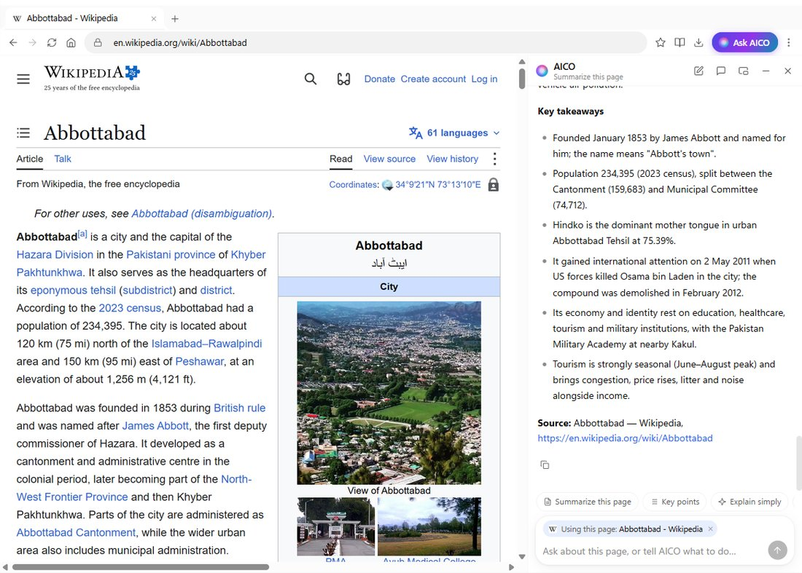
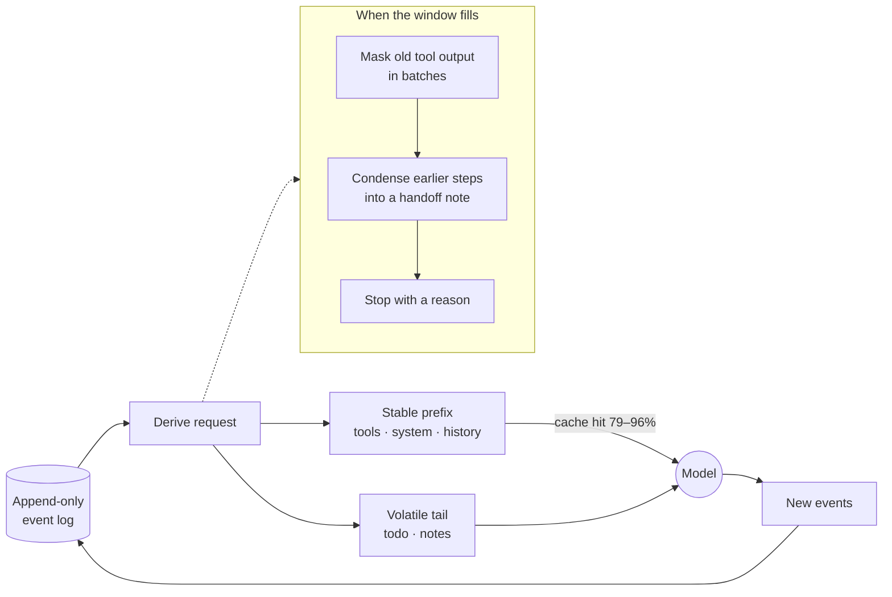
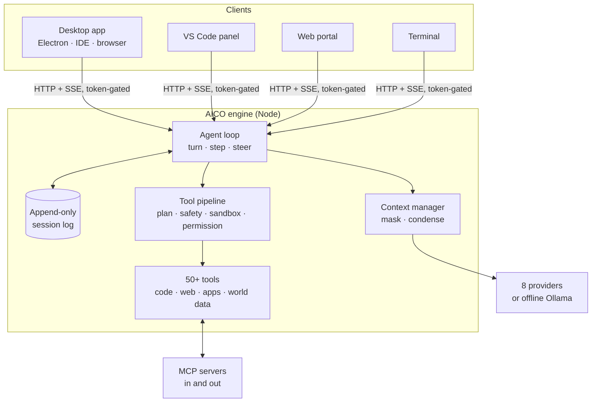

<div align="center">


<br>

[](https://github.com/suhail-akhtar/aico/releases/latest)
[](https://github.com/suhail-akhtar/aico/actions/workflows/ci.yml)
[](https://github.com/suhail-akhtar/aico/releases)
[](LICENSE)


**[⬇ Download the desktop app](#-download)** &nbsp;·&nbsp;
**[Website](https://suhail-akhtar.github.io/aico/)** &nbsp;·&nbsp;
**[Guide](GUIDE.md)** &nbsp;·&nbsp;
**[How it compares](https://suhail-akhtar.github.io/aico/compare.html)** &nbsp;·&nbsp;
**[Changelog](CHANGELOG.md)**

</div>

---

**AICO is an AI agent that works on your computer, for you, with your own key.**
It writes and fixes real code, plans and builds whole apps and proves they work in
a real browser, drives a browser of its own, runs long jobs without losing the
thread — and answers everyday questions with maps, charts, forecasts, videos and
documents you can edit. One engine, four ways in: a **native desktop app**,
**VS Code**, a **local web portal** and the **terminal**.

It is built around one idea other agents skip: **every request is derived from an
append-only event log.** That single decision is why its prompt cache hits
**79–96%** of the time, why it can run for hours without forgetting what you asked,
why you can steer it mid-run, and why every answer can show exactly what it read.

<div align="center">

</div>

<sub>Methods and raw evidence: [SWE-bench Lite probes](benchmarks/swebench-lite/README.md) ·
[long-horizon runs](benchmarks/long-horizon/README.md) ·
[custom-stack architecture probe](benchmarks/custom-app-architecture/README.md) ·
[prompt caching](#-token-saving-by-design). Self-run, reproducible, and honest about
their limits — none of these is an official leaderboard submission.</sub>

---

## ⬇ Download

| | Get it | Notes |
|---|---|---|
| **Windows** (10/11, x64) | [**AICO-Setup-0.27.0-win-x64.exe**](https://github.com/suhail-akhtar/aico/releases/download/v0.27.0/AICO-Setup-0.27.0-win-x64.exe) | Installer · updates itself · not code-signed yet, so SmartScreen asks once (*More info → Run anyway*) |
| **Linux** (x64) | [**AppImage**](https://github.com/suhail-akhtar/aico/releases/download/v0.27.0/AICO-0.27.0-linux-x64.AppImage) · [**.deb**](https://github.com/suhail-akhtar/aico/releases/download/v0.27.0/AICO-0.27.0-linux-x64.deb) | AppImage updates itself; the .deb best-effort |
| **VS Code** | [**aico-vscode-0.6.22.vsix**](https://github.com/suhail-akhtar/aico/releases/download/v0.27.0/aico-vscode-0.6.22.vsix) | `code --install-extension aico-vscode-0.6.22.vsix` |
| **Web portal + terminal** | `npx github:suhail-akhtar/aico#v0.27.0 serve` | Node 22.5+; nothing else to install |

Every build: **[latest release](https://github.com/suhail-akhtar/aico/releases/latest)**.
The desktop app needs no Node install — the engine runs inside it — and shares
`~/.aico` (chats, keys, skills, settings) with every other way in.

---

## ✨ What makes it different

<table>
<tr>
<td width="50%" valign="top">

### 💸 Token-saving by design
Requests are built from an append-only log, so the prompt prefix never changes
behind the model's back and **provider prompt caches actually hit — 79–96%
measured.** On DeepSeek a cached token costs **1/50** of a fresh one; on OpenAI
and Anthropic, 1/10. Old tool output is masked in batches (so the cache breaks
rarely), not re-sent forever. [How →](#-token-saving-by-design)

</td>
<td width="50%" valign="top">

### 🧭 Long-horizon runs that stay correct
Before every step the loop measures the next request and, cheapest first, masks
stale tool output, condenses earlier steps into a handoff note that keeps **your
words verbatim**, the plan, the todo list and every file touched — never a lossy
summary of a summary. **140 of 140 values correct** across long runs on two
models, with peak context **halved**. [How →](#-long-horizon-runs)

</td>
</tr>
<tr>
<td valign="top">

### 🛠 Real software engineering, measured
**73 of 80 real GitHub issues resolved (91%)** from SWE-bench Lite — django,
sympy, scikit-learn, matplotlib, pytest, sphinx, requests, flask… — working
blind, graded by each project's own hidden tests. Greenfield apps from ambiguous
briefs: **4 of 5 clean (17/17 checks)**. A hidden 23-test suite: **23/23** on two
models. [Evidence →](#-software-engineering-proof)

</td>
<td valign="top">

### ✅ It checks its own work
A turn that built a web page **cannot end** until the page was opened in a real
browser and passed: no uncaught errors, the canvas actually drawn, and every
control *you* named actually doing something. Reading the code it just wrote
doesn't count. Plus `Read`-before-`Edit` enforced, a repeat-loop guard, and
spend caps.

</td>
</tr>
<tr>
<td valign="top">

### 🗺 Answers you can use, not just read
Maps of real places with an "Open now" filter, weather, currency, live sports
scores, YouTube, products, news, **editable canvas documents**, generated
images, 54 dashboard widgets, charts, diagrams, and maths that is **computed**,
not written. Every answer shows its **sources** — the pages it actually read.

</td>
<td valign="top">

### 🔑 Yours, all the way down
**Your key** (OpenAI, Anthropic, Gemini, OpenRouter, DeepSeek, Kimi, Z.AI, or
**offline with Ollama**), your git history, your files, your machine. MIT
licensed. No platform markup on top of the model. Plugins for every piece, and
an agent that can write them for you.

</td>
</tr>
</table>

---

## 🖥 The desktop app

A ChatGPT-style chat in front, an IDE behind it, and a browser the agent drives —
for **Windows and Linux**, updating itself.

<p align="center"></p>
<p align="center"><sub><b>Canvas</b> — the agent writes, you edit, side by side. "Make it shorter" updated the open document live to version 3, keeping the line you added; history shows who wrote what.</sub></p>

<table>
<tr>
<td width="50%"></td>
<td width="50%"></td>
</tr>
<tr>
<td><sub><b>Places</b> — real OpenStreetMap data, pins and cards; <i>Expand</i> for a full map with a list, hours, phone and directions.</sub></td>
<td><sub><b>Weather</b> — live Open-Meteo forecast, °C/°F. Currency converts both ways with the rate's date and source.</sub></td>
</tr>
<tr>
<td></td>
<td></td>
</tr>
<tr>
<td><sub><b>Videos</b> play in the answer; the player loads only when you press play.</sub></td>
<td><sub><b>Sources</b> — the pages the agent actually searched and read, derived from its own tool calls.</sub></td>
</tr>
<tr>
<td></td>
<td></td>
</tr>
<tr>
<td><sub><b>Live sports</b> — scores, fixtures and standings (ESPN, TheSportsDB); the agent never invents a score.</sub></td>
<td><sub><b>Profile menu</b> with submenus; tooltips, right-click menus and notifications throughout.</sub></td>
</tr>
<tr>
<td></td>
<td></td>
</tr>
<tr>
<td><sub><b>An IDE</b> — Monaco, real terminals, full source control, GitHub PRs, checks, issues and Actions.</sub></td>
<td><sub><b>54 dashboard widgets</b> on a 12-column grid, plus plots, geometry and unit-aware calculations.</sub></td>
</tr>
</table>

**Highlights**

- **Chat that keeps up** — `/` actions and `@` mentions for files, folders and agents; steer a run while it works; jump to the start of a finished answer; branch any answer into a new chat; read aloud; 👍/👎 that the agent learns from.
- **Canvas** — documents and code the agent writes and **you edit side by side**, with versions, restore, and *Ask AI* on a selection.
- **An IDE behind the chat** — Monaco editor, real terminals, source control that never force-pushes, and GitHub through `gh`: review a PR, fix a failing check, diagnose an Action — with AI.
- **An AI browser** — see below.
- **It can see** — screenshots, images it reads or fetches, and pictures from any MCP tool reach models that read images; which models do is *learned* with a one-click probe, not guessed.
- **Skills and agents, made your way** — import Claude-format `.skill` files, `SKILL.md` or folders; export them; define your own agents with tools, skills, a model and their own knowledge and scripts — or ask the agent to build them.
- **Plugins, all the way down** — every feature is a plugin you can switch off; add pages, commands, themes, widgets and standing instructions with a JSON manifest, or say *"make me a plugin that…"*.
- **Looks after itself** — automatic updates that wait for running work, backup & restore to move machines, right-click menus, tooltips, notifications and a tray.

### 🌐 The AI browser

<p align="center"></p>

A full browser — tabs, an omnibox with suggestions, bookmarks, history, downloads,
find, zoom, print, reader mode, site info with certificates and permissions, and
**tracker blocking on by default** — with **AICO riding along**:

- **Ask AICO about any page.** A copilot docked beside the page (or floating) knows what you are looking at: *Summarize*, *Key points*, *Explain simply*, *Extract tables*, *Find prices*, *Compare tabs*, *Translate* — answered with the full renderer, charts and maps included. It is its own conversation, so browsing never takes over your chat.
- **Let it do the clicking.** The agent reads pages as clean Markdown, understands forms, fills them in one go, answers dialogs, uploads (after you approve), waits for pages, and reports what changed after every action. You watch it happen: the element it is about to touch is highlighted, the page glows while it drives, and **Stop** / **Take over** are one click away.
- **Safe by design.** It never solves CAPTCHAs or "I'm human" checks, never types passwords, card numbers or one-time codes, and asks before anything that buys, books, sends or deletes — it hands the page to you, then carries on. JavaScript dialogs, sign-in prompts, permissions and certificate errors all come to you; a bad certificate is never waved through.

---

## 🧩 Rich answers — in every client

Fenced blocks the model emits become interactive cards in the desktop, the web
portal and VS Code alike — each with a published spec so the model stops
guessing, a streaming placeholder, copy/download/expand, and a **Fix with AI**
button that repairs a broken block in place.

| Category | Blocks | Fed by |
|---|---|---|
| **World** | `places` (map + cards), `weather`, `currency`, `sports` (live scores, standings), `news`, `video` | `Places` (OpenStreetMap), `Weather` (Open-Meteo), `CurrencyRates`, `SportsScores`, web search |
| **Work** | `canvas` (editable documents & code), `draft` (email/post/report), `files`, `products` (cards + comparison), `images` | `Canvas`, `GenerateImage` (your OpenAI or Gemini key), the agent's own files |
| **Data** | `chart` (ECharts), Vega-Lite, tables, `widgets` (54-widget dashboard kit) | the conversation, your files |
| **Maths & science** | `plot` (symbolic derivatives, integrals), `geometry` (measured figures), `calc` (units carried through every step), KaTeX + chemistry | computed by mathjs — not written by the model |
| **Diagrams** | 26 software-engineering diagram types (Mermaid and more) | the model, repaired in place when it fails to parse |

> Honest by construction: OpenStreetMap has no ratings, reviews or photos, so the
> agent adds those only from a page it actually read — and says where from.

---

## 💸 Token-saving by design



- **The prefix never moves.** Because a request is *derived* from an append-only log, everything before the newest step is byte-identical to the last request — exactly what provider caches reward. Volatile notes go at the end and stay where they were sent, so OpenAI's cache grows with the conversation (measured cached tokens per step: **14.1K → 16.6K → 19.1K → 21.7K**, where it used to sit flat at the 13.9K static prefix).
- **Every provider's cache, used properly.** Explicit `cache_control` on Anthropic (tools and system for an hour, the conversation for five minutes); `prompt_cache_key` and sticky routing on OpenAI/OpenRouter; DeepSeek, Kimi and Z.AI implicit caching kept warm.
- **Masking is batched.** Every mask breaks the cache once, so stale tool output is folded only past half the window, capped, and in batches — measured to be the difference between saving money and spending it.
- **Zero-token scaffolding.** App templates copy in as files, skills load only when selected, the codebase index is queried and never pasted, and widget specs are fetched on demand — the model pays for what it uses.
- **Spend you control.** Per-session cost and token ceilings (sub-agents count toward them), estimated vs billed cost kept apart, and a cost ceiling printed before any evaluation run.

## 🧭 Long-horizon runs

Long jobs fail in two ways: they run out of window, or they quietly forget what
you asked. AICO measures each next request from the provider's own token count
and, cheapest first:

1. **masks** older tool output behind a note of what was there and where the full text is saved — the newest results stay whole;
2. **condenses** earlier steps of the running turn into a handoff note — your messages **word for word**, the plan and whether you approved it, the todo list and every file read or changed, taken from the record rather than trusted to a summary. An earlier note's sections are carried forward, not re-summarised, so the fifth condensation still has your original request;
3. **stops with a reason** if a single step is larger than the window, instead of summarising in a loop.

Plus: **steer a run mid-flight** (delivered at the next step boundary, nothing lost), durable queues that survive a crash, background agents and scheduled jobs under one supervised work ledger, and dev servers detected and backgrounded so nothing holds a turn hostage. Measured: **140/140 values correct, every turn `completed`, peak context 201K → 115K**. [Full results →](benchmarks/long-horizon/README.md)

## 🛠 Software engineering proof

| Probe | Result | What it shows |
|---|---|---|
| [**SWE-bench Lite**](benchmarks/swebench-lite/README.md) — real GitHub issues from 12 open-source repos, graded by each project's own tests | **73 / 80 resolved (91.25%)** — two disjoint random draws, 35/40 then 38/40 | Fixing real bugs in large, unfamiliar codebases from the issue text alone — django 29/31, sympy 17/19, scikit-learn 6/6, matplotlib 5/5, pytest 4/4, sphinx 3/3 … |
| [**Custom-stack architecture**](benchmarks/custom-app-architecture/README.md) — ambiguous greenfield briefs, no template | **4 / 5 built clean (17/17 checks each)**; the fifth hit a real iteration cap at 60% | Deciding the data model, stack and boundaries — not just filling in a template |
| **Hidden-test implementation** — a spec, 7 visible tests, graded by 23 it never saw | **23 / 23** on both gpt-5.6-luna and gpt-5.6-terra | Implementing to a spec, not to the visible tests |
| **Nine app templates** — each built end to end by a real model | **9 / 9 proven live**, opened in a browser at two widths | The app platform works as a whole |

Every one is reproducible from scripts in this repository, with per-instance
evidence committed. SWE-bench was run blind — no dependency install, no local
test runs — with `deepseek-v4-flash`, one of the cheapest capable models; it is a
self-run probe, not a leaderboard entry, and the [caveats](benchmarks/swebench-lite/README.md)
say exactly what that means.

In the desktop app the same agent works on **your** GitHub: review a pull request,
fix a failing check, diagnose a broken Action — through the `gh` CLI you already
use, never with a force-push.

---

## 🏗 Architecture



- **One engine, four clients.** The desktop, VS Code and the web portal share one state layer and one renderer; the desktop is a client, not a fork.
- **Turn / step.** A step is one model request plus its tool calls; a turn is zero or more steps; both are durable events, and turns end with a structured reason (`completed | max-tokens | blocked | aborted | error`).
- **Tool pipeline.** Policy runs as ordered stages — hooks, plan mode, bash safety, sandbox, permission — where guards can only *deny*. Parallel-safe calls run in a pool; results commit **in model order**, so a step replays identically.
- **MCP both ways.** Connect any MCP server; AICO is itself an MCP server another AI can hand work to. The desktop exposes the whole IDE and its browser to the agent the same way (`ide_*`, `browser_*`).

---

## 🚀 Install & quick start

```sh
npx github:suhail-akhtar/aico#v0.27.0 serve     # web portal, nothing to install
npm install -g github:suhail-akhtar/aico#v0.27.0 # `aico` on your PATH (VS Code needs this)
```

```sh
aico provider add                      # interactive setup
aico                                   # terminal chat
aico -p "fix the failing tests"        # one-shot
aico -c                                # continue the last session
aico --agent review -p "review my diff"
```

`#v0.27.0` pins a release, `#release/v0.27` follows its fixes, `#main` is the
trunk. From source: `git clone … && npm install && npm run build && npm run build:web`.
Requires **Node 22.5+** (built-in SQLite).

### Providers

| Provider | Key | Notes |
|---|---|---|
| **OpenAI** | `OPENAI_API_KEY` | Responses API for gpt-5.6/gpt-6 (tools + reasoning together); image generation |
| **Anthropic** | `ANTHROPIC_API_KEY` | Explicit `cache_control` for ~90% input savings |
| **Google Gemini** | `GEMINI_API_KEY` | Widest input surface (image, audio, video) |
| **OpenRouter** | `OPENROUTER_API_KEY` | Any model; sticky routing keeps caches warm |
| **DeepSeek** | `DEEPSEEK_API_KEY` | V4; cache hits at 1/50 of a miss; the model behind the benchmarks |
| **Moonshot Kimi** | `MOONSHOT_API_KEY` | K3, K2.7 Code, K2.6; reasoning replayed |
| **Z.AI (GLM)** | `ZAI_API_KEY` | Implicit caching; Coding Plan endpoint |
| **Ollama** | *(none)* | Local, free, private — fully offline |

The model name picks the provider (`aico -m glm-4.6` goes to Z.AI). Keys live in
`~/.aico/settings.json` (`aico provider add` or Settings → Models, where each
provider's models are a searchable list and *Test* checks which ones read images).

---

## 🔍 Deep dive

<details>
<summary><b>It checks its own work — <code>VerifyApp</code></b></summary>

Three models were once asked for a single-file 3D planner and a keyword check
scored two of them 12/12. Opened in a browser, one threw on load and the other
was a shell. Nothing had ever *run* the artifact.

`VerifyApp` opens the page in a real browser and reports what a person would hit:
uncaught exceptions, console errors, failed requests, what rendered (including
whether a `<canvas>` was ever painted) and whether named controls do anything.

```
FAILED — file:///…/index.html has 3 problem(s). This artifact is not finished.
  - uncaught: THREE is not defined
  - 1 of 1 canvas element(s) were never drawn to
  - "brand colour picker" does not work: set a new colour, and nothing changed
```

The verdict is not advisory: a turn that produced a web page cannot end
`completed` until a passing verdict exists for the file *as it stands now*. The
requirements are read out of **your** words, not the model's — a model that
writes its own acceptance criteria writes ones it has met. Flows (sign in, add a
customer) are checks with steps and expectations; screenshots are shown back to
models that read images.

</details>

<details>
<summary><b>Steering, planning and running things</b></summary>

- **Steer mid-run.** Type while it works; the message lands at the next step boundary and the turn is extended, not cancelled. Queues are durable across crashes.
- **Plan first.** Plan mode removes the write tools entirely; the agent investigates and proposes a structured plan you can *Go ahead*, *Amend*, save for *Later* or *Decline*. Assumptions appear above the steps.
- **Bash is one-shot; servers go to the background.** Dev servers, watchers and tails are detected and backgrounded with their pid and URL. Nothing runs forever — a backstop wraps every tool dispatch (this replaced a 139-minute hang).
- **`Terminal` remembers** its directory and environment between calls. **`Read` before `Edit`** is enforced, not requested.

</details>

<details>
<summary><b>Apps — build real applications, not snippets</b></summary>

Nine templates — a records page over SQLite, a landing page, a Hono JSON API, a
Next.js app with accounts, a metrics dashboard, a docs site, a CLI, an LLM agent
service and an Expo mobile app — copy in as files (zero model tokens) with a worked
feature, tests, notes for the agent, a backlog and a deploy script. Or a custom
stack from a description. The turn cannot end until the app was opened in a real
browser and its own checks are green; **Deploy** runs the script it ships with. A
conversation bound to an app shows a live preview at desktop, tablet and phone
widths, the backlog, decisions, files and logs.

</details>

<details>
<summary><b>Skills, agents and learning</b></summary>

- **Skills** are Claude-compatible folders (`SKILL.md` + scripts, references, templates) — import, export, write, or ask the agent to create or improve one. `aico skill eval` scores a skill against tasks with known answers; `aico skill optimize` proposes edits and keeps only what scores **strictly higher on validation tasks the optimiser never saw**.
- **Agents** — 17 built in (review, security-audit, architect, qa, devops…) plus your own with their own tools, skills, model, knowledge and scripts. `Task` spawns sub-agents that **inherit every constraint** of their parent — plan mode, sandbox, spend caps.
- **It learns, with you as the gate.** Ratings with notes, mid-turn corrections and repeated errors become *proposals* you keep or dismiss; kept ones become knowledge shown on later tasks whose wording matches.

</details>

<details>
<summary><b>Safety — layered, and honest about what each layer enforces</b></summary>

| Layer | What it does |
|---|---|
| **Permissions** | Mutating tools ask first (with a diff preview), or auto / ask-before-edits / ask-every-time per message |
| **Bash safety classifier** | Blocks `rm -rf /`, `mkfs`, `curl \| bash`, shell-profile writes, credential exfiltration and ~40 more patterns |
| **Plan mode** | Read-only tools only — inherited by sub-agents |
| **Sandbox** (opt-in) | `workspace-write` / `read-only`: **full** for AICO's own file tools, **partial** for spawned processes (says so) |
| **Repeat guard** | Detects a model looping on identical calls and makes it change approach |
| **Spend caps** | Per-session cost and token ceilings, sub-agents included |
| **Network surfaces** | The server binds to `127.0.0.1` with a startup token; the desktop never hands the token to page code |

Not a sandbox for untrusted code — review what it runs.

</details>

<details>
<summary><b>VS Code</b></summary>

A native panel in the Secondary Side Bar that shares the web client's state
layer and renderers. Edits arrive as `WorkspaceEdit`s (so <kbd>Ctrl</kbd>+<kbd>Z</kbd>
and Source Control work), it knows your active file, selection and Problems, and
the editor is a tool: `VSCodeDiagnostics`, `VSCodeTasks`, `VSCodeReferences`,
`VSCodeRename`, `VSCodeFormat`. Install the `.vsix` from the
[release](https://github.com/suhail-akhtar/aico/releases/latest) and reload the window.

</details>

<details>
<summary><b>Configuration</b></summary>

`~/.aico/settings.json` (global) merged with `.aico/settings.json` (project):

```jsonc
{
  "model": "gpt-5.6-terra",
  "providers": { "openai": { "reasoningEffort": "high" } },
  "autoCompact": { "thresholdPercent": 75, "keepRecentTurns": 3 },
  "contextManagement": { "keepRecentToolResults": 6, "midTurnCompaction": true, "reciteTodos": true },
  "promptCaching": { "prefixTtl": "1h" },
  "sandbox": { "mode": "workspace-write" },
  "safetyLimits": { "maxCostPerSession": 5.00 },
  "imageGeneration": { "provider": "openai", "model": "gpt-image-1", "quality": "low" },
  "mcpServers": { "playwright": { "command": "npx", "args": ["@playwright/mcp"] } }
}
```

Everything outside a project lives under `~/.aico`; set `AICO_HOME` to move it.
Full reference: **[GUIDE.md](GUIDE.md)**.

</details>

<details>
<summary><b>Testing</b></summary>

```sh
npm test                    # 3,200+ offline engine assertions, no key needed
npm run test:web:unit       # web renderers and reducers
npm --prefix desktop test   # desktop units
npm run test:live           # live assertions against a real model — costs money
node scripts/long-horizon-live.mjs deepseek-flash default 30
```

The live suite covers what a mock cannot: wire formats, streaming, tool round
trips, prompt caching, truncation, cancellation, steering, compaction, sandbox
confinement and sub-agent inheritance. Session logs carry runtime invariants
(ordering, turn balance, call/result pairing) asserted by every test that
produces one. Tests never touch your real `~/.aico`.

</details>

<details>
<summary><b>Honest limitations</b></summary>

- **`Bash` is not confined** by the sandbox — AICO's own file tools are; spawned processes are not.
- **Verification covers the web.** A CLI, a library or a server has no browser gate; its checks are the tests the agent ran.
- **Desktop builds are not code-signed yet**; there is no macOS build yet.
- **Map data is OpenStreetMap** — real places, hours and phones, but no ratings or photos, and thin in some regions.
- **The VS Code extension is a `.vsix`**, not a Marketplace listing yet.
- **Benchmarks are self-run** with published evidence, not independently audited.

</details>

---

## 🤝 Contributing & development

```sh
npm ci && npm --prefix web ci && npm --prefix desktop ci
npm run dev                  # engine, watch mode
npm --prefix desktop start   # build and run the desktop app
npm test
```

Design decisions live in the module headers next to the code they govern
(`src/session/`, `src/registry/`, `src/sandbox/`, `desktop/DESIGN.md`) rather
than in a document that drifts. Issues and pull requests are welcome.

## License

[MIT](LICENSE) © Suhail Akhtar
