<div align="center">

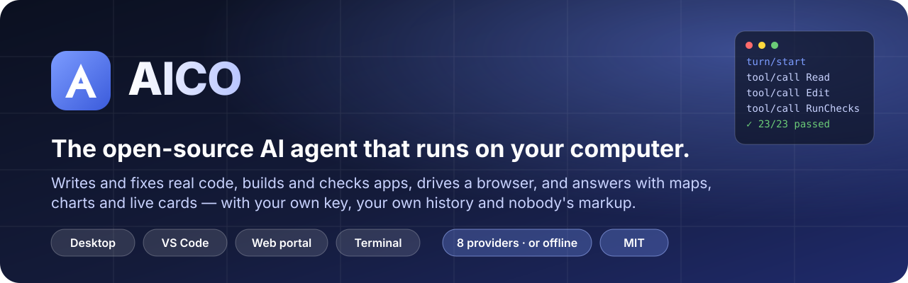

<br>

[](https://github.com/suhail-akhtar/aico/releases/latest)
[](https://github.com/suhail-akhtar/aico/actions/workflows/ci.yml)
[](https://github.com/suhail-akhtar/aico/releases)
[](LICENSE)


**[⬇ Download the desktop app](#-download)** &nbsp;·&nbsp;
**[Website](https://suhail-akhtar.github.io/aico/)** &nbsp;·&nbsp;
**[Guide](GUIDE.md)** &nbsp;·&nbsp;
**[How it compares](https://suhail-akhtar.github.io/aico/compare.html)** &nbsp;·&nbsp;
**[Changelog](CHANGELOG.md)**

</div>

---

**AICO is an AI agent that works on your computer, for you, with your own key.**
It writes and fixes real code, plans and builds whole apps and proves they work in
a real browser, drives a browser of its own, runs long jobs without losing the
thread — and answers everyday questions with maps, charts, forecasts, videos and
documents you can edit. One engine, four ways in: a **native desktop app**,
**VS Code**, a **local web portal** and the **terminal**.

It is built around one idea other agents skip: **every request is derived from an
append-only event log.** That single decision is why its prompt cache hits
**79–96%** of the time, why it can run for hours without forgetting what you asked,
why you can steer it mid-run, and why every answer can show exactly what it read.

<div align="center">
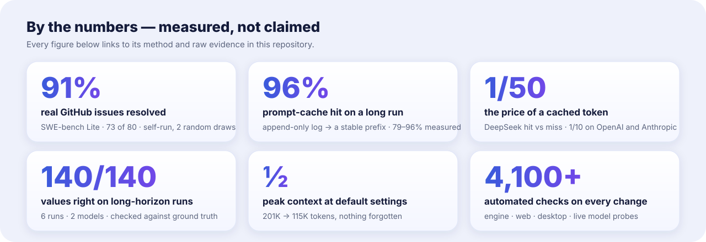
</div>

<sub>Methods and raw evidence: [SWE-bench Lite probes](benchmarks/swebench-lite/README.md) ·
[long-horizon runs](benchmarks/long-horizon/README.md) ·
[custom-stack architecture probe](benchmarks/custom-app-architecture/README.md) ·
[prompt caching](#-token-saving-by-design). Self-run, reproducible, and honest about
their limits — none of these is an official leaderboard submission.</sub>

---

## ⬇ Download

| | Get it | Notes |
|---|---|---|
| **Windows** (10/11, x64) | [**AICO-Setup-0.47.0-win-x64.exe**](https://github.com/suhail-akhtar/aico/releases/download/v0.47.0/AICO-Setup-0.47.0-win-x64.exe) | Installer · updates itself · not code-signed yet, so SmartScreen asks once (*More info → Run anyway*) |
| **Linux** (x64) | [**AppImage**](https://github.com/suhail-akhtar/aico/releases/download/v0.47.0/AICO-0.47.0-linux-x64.AppImage) · [**.deb**](https://github.com/suhail-akhtar/aico/releases/download/v0.47.0/AICO-0.47.0-linux-x64.deb) | AppImage updates itself; the .deb best-effort |
| **VS Code** | [**aico-vscode-0.6.41.vsix**](https://github.com/suhail-akhtar/aico/releases/download/v0.47.0/aico-vscode-0.6.41.vsix) | `code --install-extension aico-vscode-0.6.41.vsix` |
| **Web portal + terminal** | `npx github:suhail-akhtar/aico#v0.47.0 serve` | Node 22.5+; nothing else to install |

Every build: **[latest release](https://github.com/suhail-akhtar/aico/releases/latest)**.
The desktop app needs no Node install — the engine runs inside it — and shares
`~/.aico` (chats, keys, skills, settings) with every other way in.

---

## ✨ What makes it different

<table>
<tr>
<td width="50%" valign="top">

### 💸 Token-saving by design
Requests are built from an append-only log, so the prompt prefix never changes
behind the model's back and **provider prompt caches actually hit — 79–96%
measured.** On DeepSeek a cached token costs **1/50** of a fresh one; on OpenAI
and Anthropic, 1/10. Rarely used tools load only when needed, so **every request
is 41% smaller** (~24K → ~14K tokens). Old tool output is masked in batches (so
the cache breaks rarely), not re-sent forever. [How →](#-token-saving-by-design)

</td>
<td width="50%" valign="top">

### 🧭 Long-horizon runs that stay correct
Before every step the loop measures the next request and, cheapest first, masks
stale tool output, condenses earlier steps into a handoff note that keeps **your
words verbatim**, the plan, the todo list and every file touched — never a lossy
summary of a summary. **140 of 140 values correct** across long runs on two
models, with peak context **halved**. [How →](#-long-horizon-runs)

</td>
</tr>
<tr>
<td valign="top">

### 🛠 Real software engineering, measured
**73 of 80 real GitHub issues resolved (91%)** from SWE-bench Lite — django,
sympy, scikit-learn, matplotlib, pytest, sphinx, requests, flask… — working
blind, graded by each project's own hidden tests. Greenfield apps from ambiguous
briefs: **4 of 5 clean (17/17 checks)**. A hidden 23-test suite: **23/23** on two
models. [Evidence →](#-software-engineering-proof)

</td>
<td valign="top">

### ✅ It checks its own work
A turn that built a web page **cannot end** until the page was opened in a real
browser and passed: no uncaught errors, the canvas actually drawn, and every
control *you* named actually doing something. Reading the code it just wrote
doesn't count. Plus `Read`-before-`Edit` enforced, a repeat-loop guard, and
spend caps.

</td>
</tr>
<tr>
<td valign="top">

### 🗺 Answers you can use, not just read
Maps of real places with an "Open now" filter, weather, currency, live sports
scores, YouTube, products, news, **editable canvas documents**, generated
images, 54 dashboard widgets, charts, diagrams, and maths that is **computed**,
not written. Every answer shows its **sources** — the pages it actually read.

</td>
<td valign="top">

### 🔑 Yours, all the way down
**Your key** (OpenAI, Anthropic, Gemini, OpenRouter, DeepSeek, Kimi, Z.AI, or
**offline with Ollama**), your git history, your files, your machine. Free
for personal use. No platform markup on top of the model. Plugins for every piece, and
an agent that can write them for you.

</td>
</tr>
</table>

---

## 🖥 The desktop app

A ChatGPT-style chat in front, an IDE behind it, and a browser the agent drives —
for **Windows and Linux**, updating itself.

<p align="center">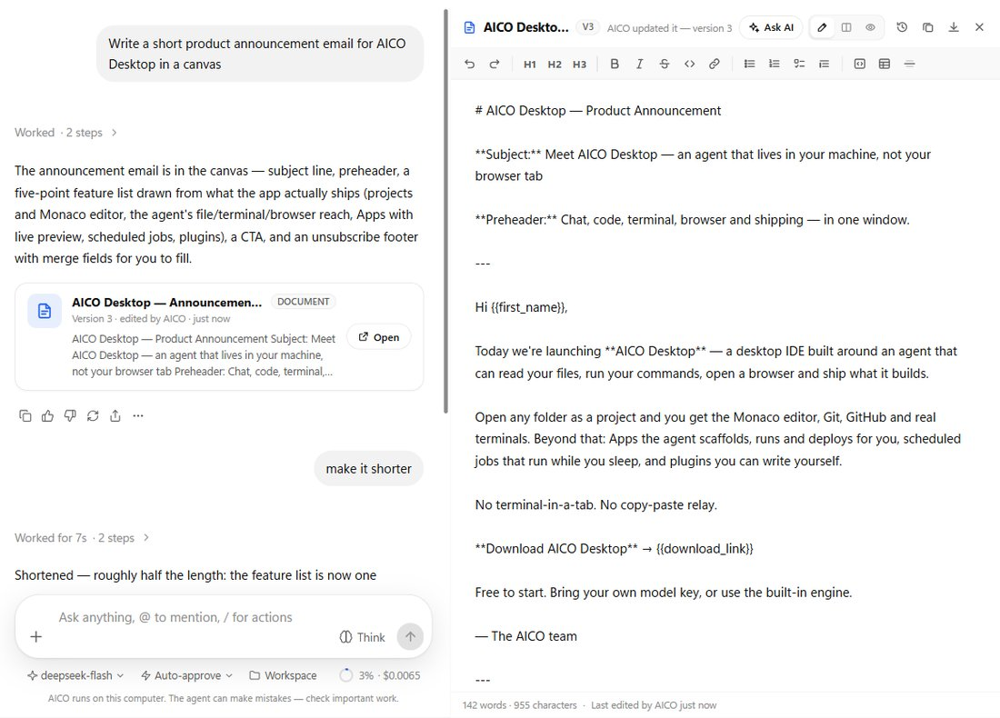</p>
<p align="center"><sub><b>Canvas</b> — the agent writes, you edit, side by side. "Make it shorter" updated the open document live to version 3, keeping the line you added; history shows who wrote what.</sub></p>

<table>
<tr>
<td width="50%">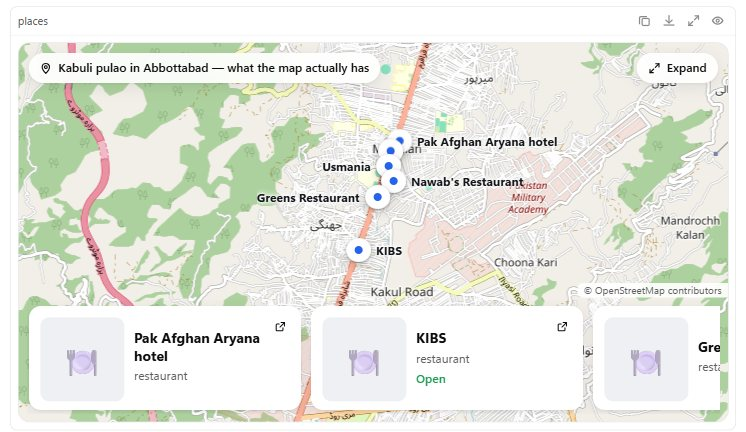</td>
<td width="50%">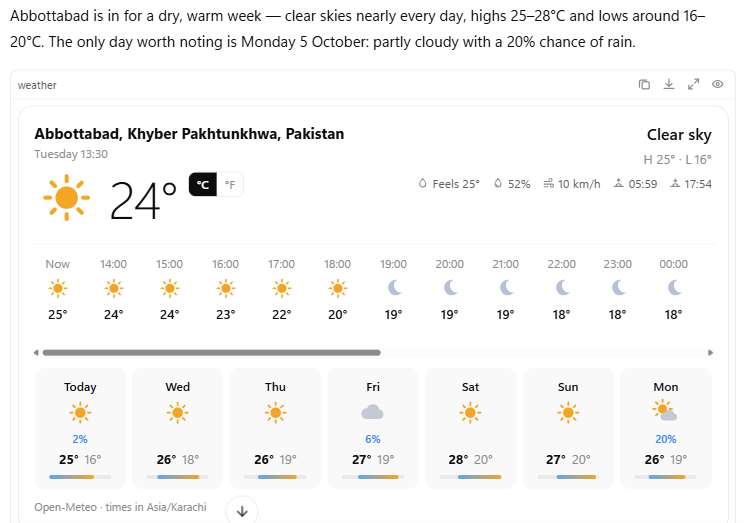</td>
</tr>
<tr>
<td><sub><b>Places</b> — real OpenStreetMap data, pins and cards; <i>Expand</i> for a full map with a list, hours, phone and directions.</sub></td>
<td><sub><b>Weather</b> — live Open-Meteo forecast, °C/°F. Currency converts both ways with the rate's date and source.</sub></td>
</tr>
<tr>
<td></td>
<td>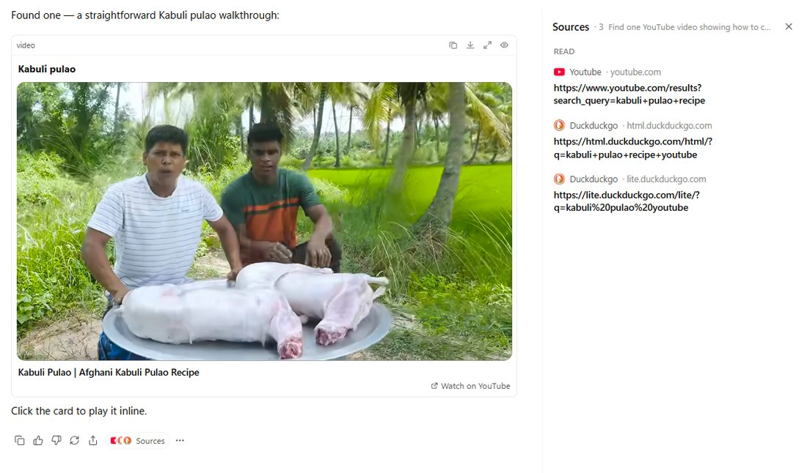</td>
</tr>
<tr>
<td><sub><b>Videos</b> play in the answer; the player loads only when you press play.</sub></td>
<td><sub><b>Sources</b> — the pages the agent actually searched and read, derived from its own tool calls.</sub></td>
</tr>
<tr>
<td>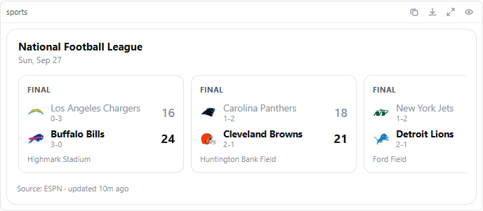</td>
<td>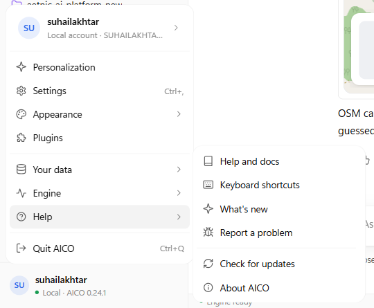</td>
</tr>
<tr>
<td><sub><b>Live sports</b> — scores, fixtures and standings (ESPN, TheSportsDB); the agent never invents a score.</sub></td>
<td><sub><b>Profile menu</b> with submenus; tooltips, right-click menus and notifications throughout.</sub></td>
</tr>
<tr>
<td>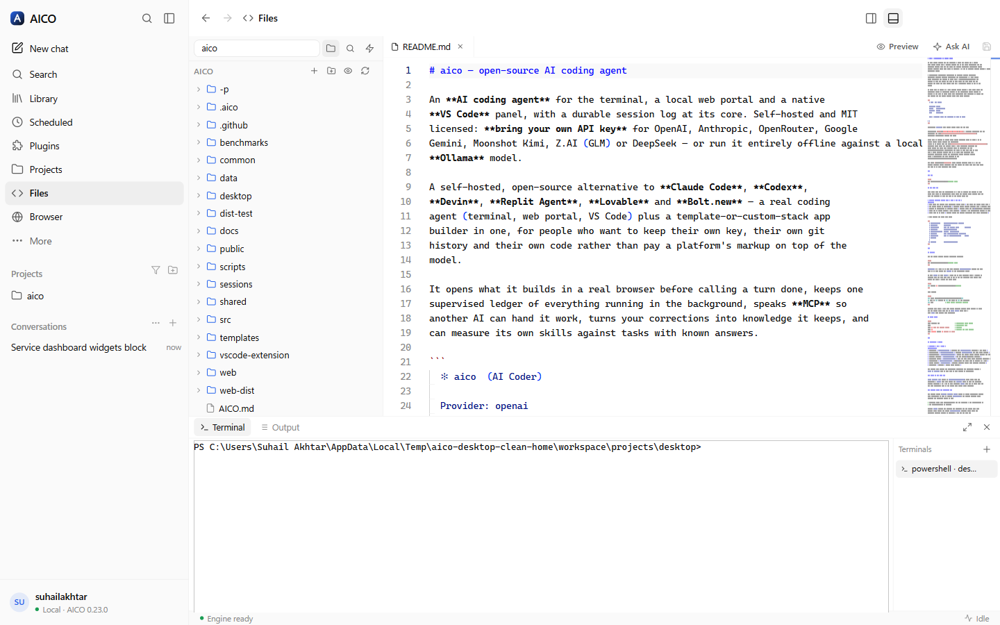</td>
<td>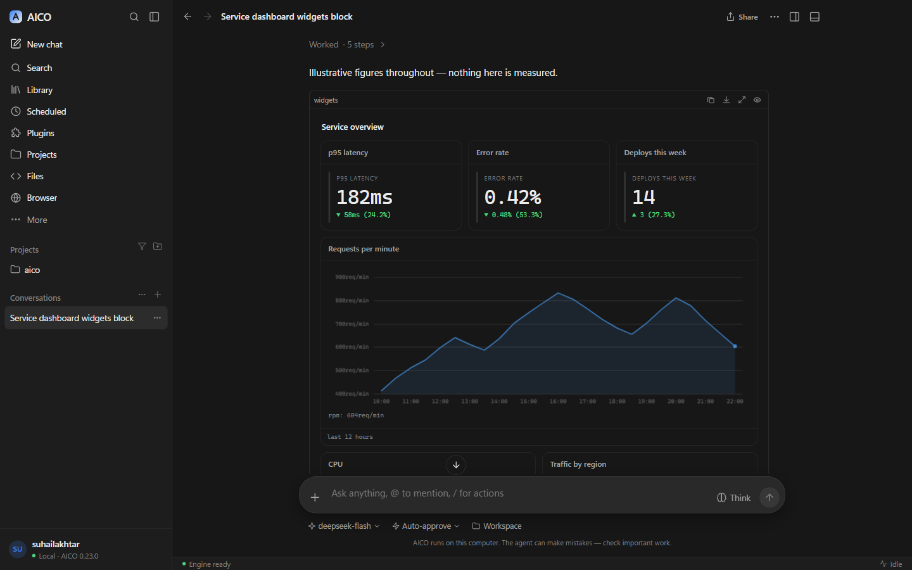</td>
</tr>
<tr>
<td><sub><b>An IDE</b> — Monaco, real terminals, full source control, GitHub PRs, checks, issues and Actions.</sub></td>
<td><sub><b>54 dashboard widgets</b> on a 12-column grid, plus plots, geometry and unit-aware calculations.</sub></td>
</tr>
</table>

**Highlights**

- **Chat that keeps up** — `/` actions and `@` mentions for files, folders and agents; steer a run while it works; jump to the start of a finished answer; branch any answer into a new chat; read aloud; 👍/👎 that the agent learns from.
- **Canvas / AICO Docs** — documents and code the agent writes and **you edit side by side**: a document page edited in place block by block (the Markdown stays exact), tabs, tables, charts, diagrams, infographics, images, comments with *@AICO*, templates, export to Word/PDF/HTML/Markdown, versions, restore, and *Ask AI* on a selection.
- **An IDE behind the chat** — Monaco editor, real terminals, source control that never force-pushes, and GitHub through `gh`: review a PR, fix a failing check, diagnose an Action — with AI.
- **An AI browser** — private, protected, learning and agent-driven; see below.
- **Credentials it uses but never sees** — a vault the agent and browser draw on by name, and server operations over SSH, APIs, WinRM and SNMP; see below.
- **It can see** — screenshots, images it reads or fetches, and pictures from any MCP tool reach models that read images; which models do is *learned* with a one-click probe, not guessed.
- **Skills and agents, made your way** — import Claude-format `.skill` files, `SKILL.md` or folders; export them; define your own agents with tools, skills, a model and their own knowledge and scripts — or ask the agent to build them.
- **Plugins, all the way down** — every feature is a plugin you can switch off; add pages, commands, themes, widgets and standing instructions with a JSON manifest, or say *"make me a plugin that…"*.
- **Looks after itself** — automatic updates that wait for running work, backup & restore to move machines, right-click menus, tooltips, notifications and a tray.

### 🌐 The AI browser

<p align="center">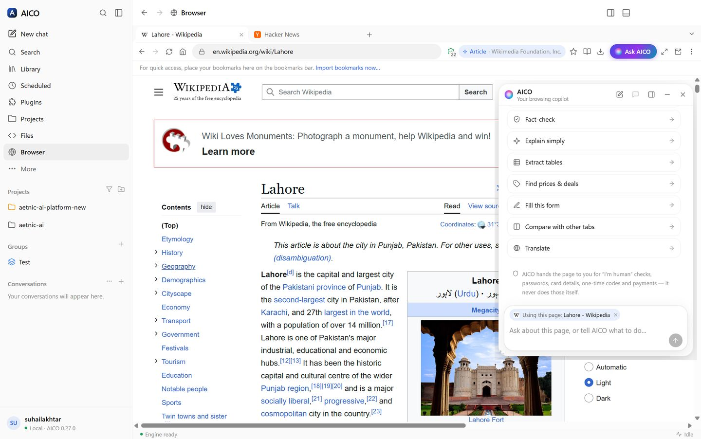</p>

A real browser — tabs you drag, pin, mute and reopen, a bookmarks bar with folders,
history, downloads, reader mode, full view, full screen and **its own window when
you want one** — built private-first, with **AICO riding along**. It remembers your
sign-ins across updates and reinstalls, and brings your tabs back where you left them.
Local dev servers and internal sites with a self-signed or private-CA certificate
open like in Chrome — **Advanced → Proceed** (only your click counts, bound to that
exact certificate, with an optional "always trust" you can manage), a red **Not secure**
badge while you're there, and no saved passwords filled in unless you say so.

<table>
<tr>
<td width="50%">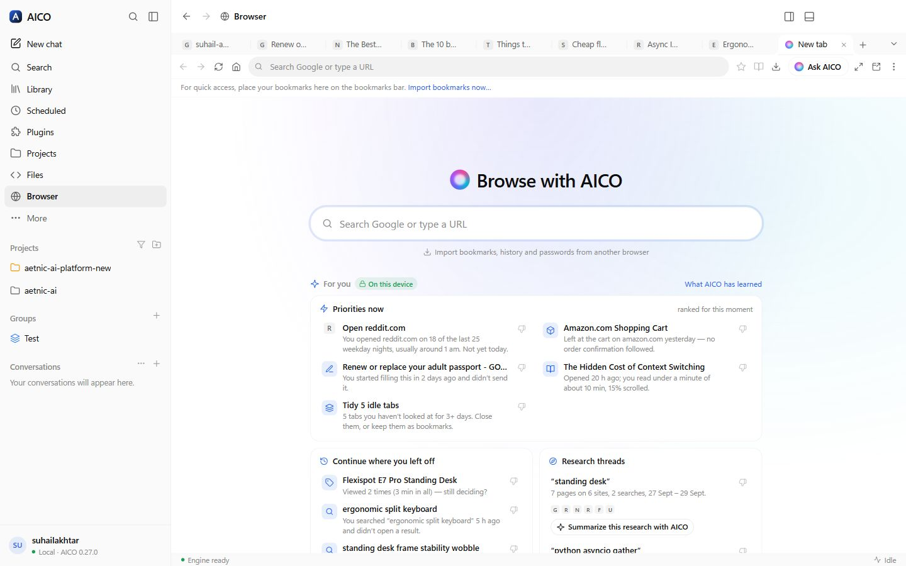</td>
<td width="50%">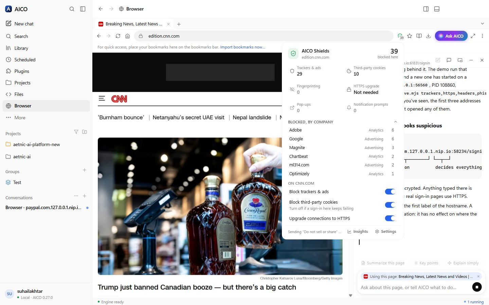</td>
</tr>
<tr>
<td><sub><b>It learns you — on this device.</b> Priorities, routines, unfinished carts and forms, research threads and idle tabs, each with the reason it is shown. <i>Not interested</i> teaches it; view, pause or forget everything.</sub></td>
<td><sub><b>Shields</b> — trackers blocked by company, third-party cookies, HTTPS-first, Global Privacy Control; per-site switches.</sub></td>
</tr>
<tr>
<td>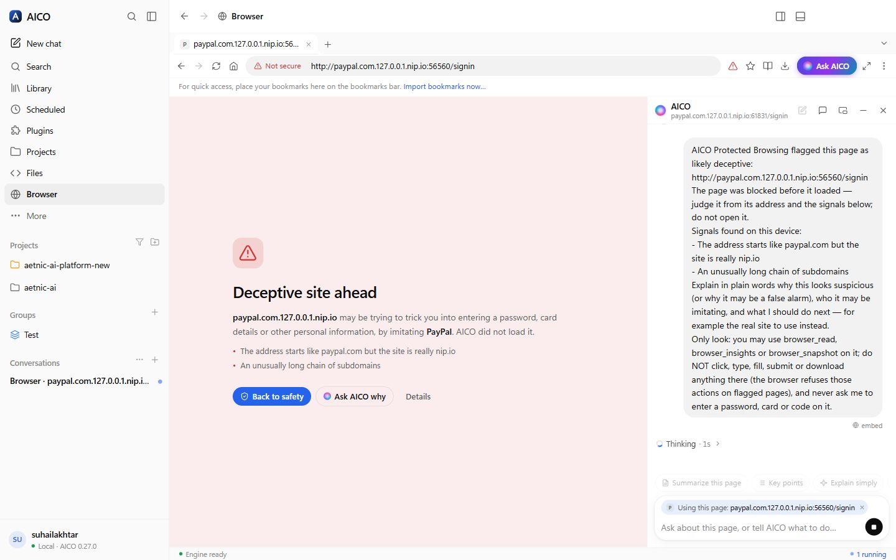</td>
<td>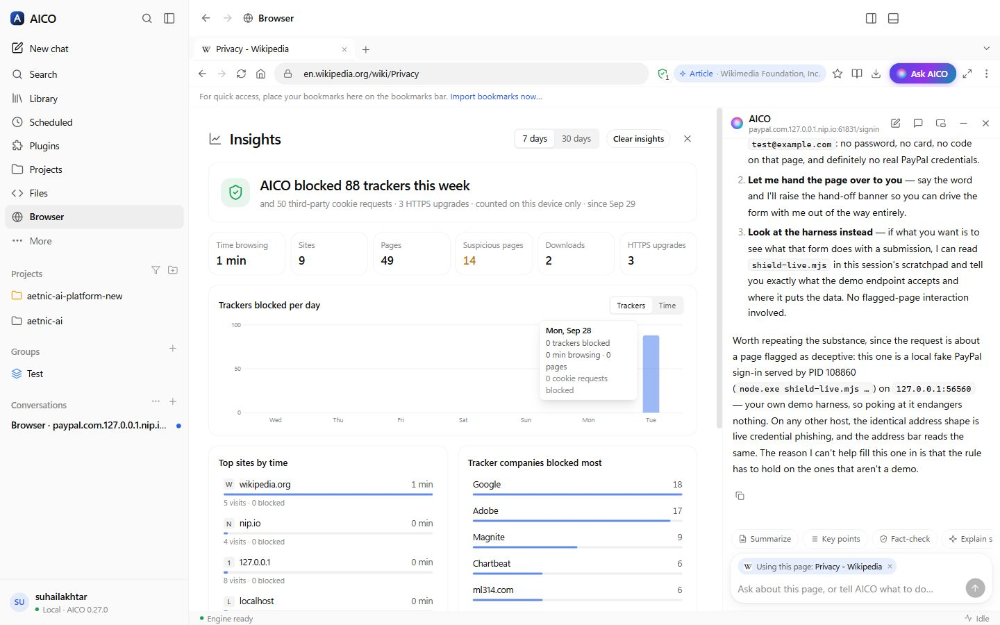</td>
</tr>
<tr>
<td><sub><b>Protected browsing</b> — look-alike and phishing pages are stopped before they load, and <b>AICO checks them for you automatically</b>. Risky downloads are flagged and marked as from the internet.</sub></td>
<td><sub><b>Insights</b> — where your time goes and what was blocked, counted only on your computer.</sub></td>
</tr>
<tr>
<td>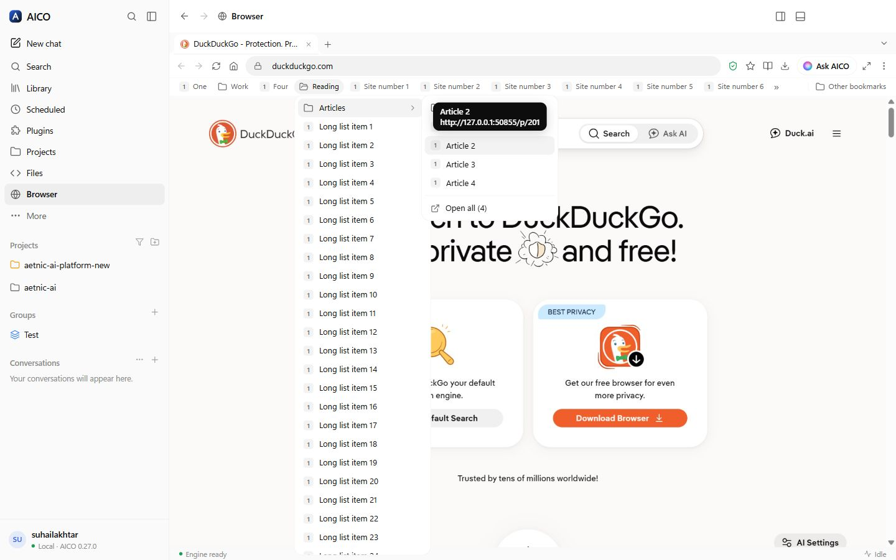</td>
<td>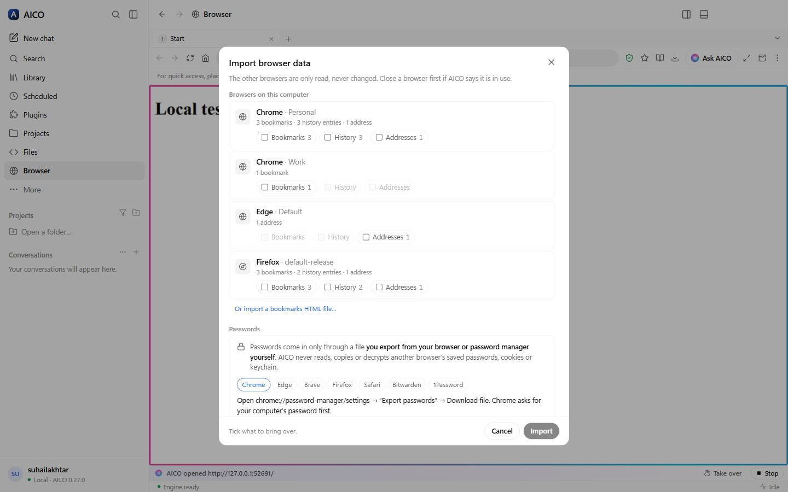</td>
</tr>
<tr>
<td><sub><b>Bookmarks like a real browser</b> — bar, folders and sub-folders, drag and drop, a manager, import and export.</sub></td>
<td><sub><b>Bring everything over</b> — bookmarks, history and addresses from Chrome, Edge, Brave, Vivaldi, Opera and Firefox; passwords from your browser's own export, into an encrypted vault.</sub></td>
</tr>
</table>

- **Ask AICO about any page.** The copilot, docked or floating over the live page, knows what you are looking at and suggests what fits it — *Compare prices* on a product, *Summarize reviews*, *Fact-check* an article, *Scale this recipe*, *Match this job to my skills*, *Draft a reply* in your mail, *Review this order before I pay* at a checkout. Right-click any link, image or selection to ask about it.
- **Let it do the work.** The agent reads pages as clean Markdown, fills whole forms (with your saved profile when you ask), answers dialogs, compares tabs, and reports what changed after every action — the element it is about to touch is highlighted and **Stop** / **Take over** are one click away. Ask *"what was I researching last week?"* or *"clean up my idle tabs"* and it uses what the browser learned — and asks before closing anything.
- **Teach it once.** Press **Teach**, do a task on a site the way you always do, press Stop — AICO turns it into a procedure: you review the steps (with screenshots), mark what varies as parameters (`{{customer_name}}`) and say what it is for. Any chat can then run it with new values in its own tab; it finds each button and field again by what it is called (a renamed or moved button still works), stops for your OK before buying, sending or deleting, and never records a password, card number or code — those are filled from a stored credential or handed to you.
- **Private by default.** Trackers and third-party cookies blocked, HTTPS-first, Global Privacy Control sent, a Chrome-standard identity with no "Electron" fingerprint, and **everything it learns stays on this computer** — no telemetry, no account.
- **Knows what you have open — and what you read.** The copilot always has a one-line picture of every open tab (page type, price, rating), so *"which of my open tabs is cheapest?"* needs no clicking around. Switch on **memory by meaning** and it remembers the pages you actually read, encrypted on this computer: *"where was that red leather jacket I looked at last week?"* finds it even after the tab is closed.
- **Can't be talked into things.** Pages can hide instructions for AI in invisible text. AICO strips text a person cannot see and marks instructions aimed at the AI as untrusted page content before the model reads anything — and the shields panel shows what it caught.
- **Safe by design.** It never solves CAPTCHAs or "I'm human" checks, never *sees* a password, card number or one-time code, and a purchase, send or delete waits for your Allow — enforced in code. It can sign in from the vault on the site a credential belongs to, without the value ever reaching the model.
- **Pop it out.** One click (Ctrl+Shift+N) moves every tab into its own window without reloading a thing; close it and they come home.
- **Many agents, no collisions.** Each chat drives its own labelled background tabs, so two projects can use the browser at once while your page stays yours; a tab two chats want is taken in turn. The browser copilot answers about the page — and hands real work (code, projects, servers) to a proper chat with the page attached.

### 🤖 Agents, skills and tools — built, verified, trusted

- **Custom agents** in Claude's agent format, with instructions, model, skills, tools (built-in, custom, MCP), delegation, an autonomy ceiling, a budget and the paths they may write — every limit enforced by the engine, and a "what this agent can do" summary computed from the same rules.
- **Certified before they run unattended.** `aico agent certify` runs a safety pack (planted instructions, secret requests, refused deletions, out-of-scope edits) and the agent's own golden tasks with side effects mocked; the certificate is tied to everything the agent depends on, and changes void it.
- **Custom tools** wrap a command or an HTTP call with typed parameters — no shell — and a risk class (read, write, exec, external, destructive); destructive calls show a preview before you approve, and secrets come from the vault.
- **Claude skills, both ways.** Import a `.skill`, a folder, a pack or a Claude plugin through a security scan and a review screen; export in Claude's format. The built-in `skill-author` drafts a skill with evals and must show it beats no skill before it is registered.
- **MCP on the current spec**, with each approved tool pinned (a changed description switches it off), secrets moved into the vault, and tools loaded only when needed.
- **Autonomy you can leave running.** Levels L0–L4; an unattended run parks anything that needs a person in a "Waiting for you" inbox, and on approval AICO runs exactly that call — or refuses if anything changed.

### 🌙 Always on — and it asks before anything big

- **Long jobs, with your go-ahead.** When AICO estimates more than ~3 hours of work, it stops and shows a proposal — research, design, milestones with acceptance criteria, time and cost — and runs only after you approve, milestone by milestone, resumable after a restart, within the budget you set.
- **A Sentinel watches the risky moves.** An independent model reviews high-risk actions (deploys, pushes, deletions, purchases, anything after reading untrusted pages) and can only stop or escalate them — never approve. 10/10 on its red-team set, ~$0.0003 a review.
- **A morning brief.** Failed CI, PRs waiting for you, new security advisories, approvals in your inbox and overnight long jobs — ranked, urgent first, with one-click actions. Opt-in monitors notify you the moment CI breaks.
- **It learns how you work.** From 👍/👎, corrections and your edits it proposes rules ("use pnpm, not npm"); you accept, edit or forget them, and accepted ones guide the next task.
- **Teach it once.** Record a workflow in the AICO browser on any internal site; AICO replays it with new values — secrets never recorded, approvals and hand-offs intact, even after the page's buttons move.
- **Spreadsheets and artifacts.** A real sheet with Excel formulas and `.xlsx` export, documents designed per type (41 types, 16 themes), and an Artifacts panel to work side by side.
- **Refactor at scale.** Structural search & replace (ast-grep) and TypeScript rename/move across a codebase — previewed, checkpointed, checked, rolled back if red.

### 📄 Documents and presentations that look designed

- **Each kind of document has its own design**: proposals, technical designs, reports, SOPs and policies, letters, papers, CVs, marketing briefs, contracts and manuals each get their own cover, front matter (document control, revisions, approvals), fonts, heading numbering, running headers, table styles and the visuals that kind needs — architecture diagrams for a design, Gantt, RACI and pricing for a proposal.
- **Word and PDF exports you can send**: real Word styles and numbering, a full cover page, contents with real page numbers, numbered captions, table headers that repeat, columns sized to their content, diagrams and charts at print resolution.
- **Presentations**: decks with real layouts (title, section, bullets, two-column, chart, diagram, table, big numbers, timeline, quote…), 12 themes and deck types (pitch, technical briefing, status, training…), slide sorter, present mode with speaker notes — exported to editable PowerPoint (native text, tables and charts), PDF or images.
- **Ask AICO about just one part.** Select a sentence, a paragraph, table cells, a chart, a diagram or a section — or on a slide, its title, a bullet, its table, chart, big numbers or speaker notes — and ask for a change: AICO knows the document's (or deck's) type, style and outline, shows a before/after, and changes nothing else — checked in code (a slide must still fit its layout), undoable in one step.

### 🧠 It knows you — and you control what it knows

- **Recall: memory by meaning.** A local index of your memories, knowledge and every past session — search by words, and by meaning once you pick an embeddings model. *"What did we decide about auth last week?"* just works. Duplicates update instead of piling up, a changed fact supersedes the old one (kept, restorable), and only memories relevant to the request are sent.
- **About you.** In the background, AICO learns your stack, interests, way of working, likes and dislikes from your work and (in the desktop) a summary of your browsing — domains and topics only, never pages or whole searches. Every fact shows why it was learned; confirm, edit, hide, forget, export or erase it. Health, religion, politics, sexuality, ethnicity, finances, location and family are never inferred — a filter in code drops them.
- **The right model for each job.** Main chat, coding and research helpers, reviewers, background jobs, the Sentinel, the judge, vision, image generation, embeddings and summaries each get their own model — presets (Balanced, Economy, Best quality, Private) or per job, with provider, price and local/cloud shown. *Keep personal data on this machine* sends the learner and embeddings only to a local model, never silently to the cloud.
- **Vision for any model.** A text-only model gets attached images described by your vision model.

### 🧵 Agents that work in parallel — and report back

- **Several helpers at once**, each in its own git worktree when they write code; uncommitted work is never thrown away.
- **Background agents report back.** Start one, keep talking; its full result lands in the chat when it finishes (failures too), within the parent's tools, budget and plan mode. Continue a finished helper with its context intact; background agents resume after a restart.
- **A Tasks panel** shows every running, waiting and finished job — helpers as a tree, live time, tokens, cost, current step, to-do progress and output — with transcript, stop, pause and retry.
- **Full autonomy, when you want it.** One switch stops the safety reviewer's "are you sure?" questions; clear harm is still refused, and buying, sending and sign-in checks still wait for you.

### 💻 A terminal that works with the agent

- Tabs follow your project; a failed command gets **Explain · Fix with AICO**; **Watch with AICO** spots errors in a dev server; an **Agent** tab shows the agent's own commands live with Stop.
- **Save as…** turns commands into a script, a custom tool or a scheduled job.
- **SSH tabs from the vault** — the password never reaches the window, and a new host key is yours to accept. The agent reads your terminals only on request, masked, and never types into yours.

### 🗺 Code map — see how your project fits together

- **An accurate map of your project** (TypeScript/JavaScript with `@/` aliases and barrels, Python, Go, Java, C#, PHP, Rust and more): a layered architecture (folders, dependents above what they depend on), a focus view of any one file, files, symbols, impact ("what breaks if I change this"), paths between files, cycles, hotspots, files that change together, and what your uncommitted changes affect. It runs locally, indexes 5,000 files in about a second, and updates as you edit.
- **Ask AICO about any part of it** — the selected files and their neighbourhood go to the chat as precise context.
- **The agent checks its own edits against it:** change an exported function and it is told which callers it has not updated yet.
- **Big projects too:** past a few thousand files the symbol you ask about is still answered exactly by the TypeScript language service on demand (seconds, memory-capped), matching the compiler's own answer.
- **Methods and interfaces, not just files:** calls are linked by the receiver's type (TypeScript through the TypeScript checker), so `BillingService.process` lists exactly its callers — never a same-named method elsewhere. Interfaces show which types implement them and why (Go by exact method sets); "Exact only" hides anything less than certain.
- **In your morning brief:** new import cycles, broken layering rules, sudden hotspots and files nothing uses any more — with **Show in Code map** and **Ask AICO to fix**. In the web client files open in VS Code (or your editor) at the line, or in a built-in viewer.

### 🛡 Security built into every change

- **Shift-left by default:** a security scan on every commit, CodeQL, dependency/lockfile/licence checks and an SBOM on every release, and a pen-test suite (1,100+ attacks on the real engine: auth, forged origins, DNS rebinding, path traversal, SSRF, secret leaks, fuzzing) in CI.
- **Fail-safe:** every guard denies when something breaks; a cloned repo's settings can only tighten safety; turning on full autonomy or loosening safety needs a real person, never the API token alone.
- **The agent's shell stays in its lane:** writing outside your project, downloading programs, installing software globally or running something just downloaded needs you — in every mode, full autonomy included.
- **Code AICO writes gets the same checks:** secrets, risky patterns and vulnerable dependencies in its own changes block "done".

### 🔐 Credentials the agent uses but never sees

Ask AICO to set up a server and it creates the service's admin account itself —
a strong password stored straight into the **credential vault**, bound to that
host. The model only ever handles a name like `{{secret:grafana-admin}}`; trusted
code puts the real value in at the moment of use and blanks it out of anything
that comes back — tool output, logs, the stream, transcripts, even when encoded.
Later, *"show me the portal"* signs the browser in from the vault: no hand-over,
and you never had to know the password.

- **One vault** for browser passwords, SSH keys, API tokens, WinRM, SNMP and database credentials — sealed with your OS keychain, with a Credential Manager to add, restrict, rotate, reveal (after a confirmation) and audit every use.
- **Secrets pasted into chat** are moved into the vault before the model reads them.
- **Server operations** — `SshExec`, `SshCopy`, `SshTunnel`, `HttpRequest`, `WinRmExec`, `SnmpQuery`: host keys pinned, cloud metadata addresses refused, and destructive commands, first connections and device changes always asked first. Long runs are supervised like any background work.

Details: [docs/security/credential-broker.md](docs/security/credential-broker.md) · [docs/security/ops-tools.md](docs/security/ops-tools.md)

---

## 🧩 Rich answers — in every client

Fenced blocks the model emits become interactive cards in the desktop, the web
portal and VS Code alike — each with a published spec so the model stops
guessing, a streaming placeholder, copy/download/expand, and a **Fix with AI**
button that repairs a broken block in place.

| Category | Blocks | Fed by |
|---|---|---|
| **World** | `places` (map + cards), `weather`, `currency`, `sports` (live scores, standings), `news`, `video` | `Places` (OpenStreetMap), `Weather` (Open-Meteo), `CurrencyRates`, `SportsScores`, web search |
| **Work** | `canvas` (editable documents & code), `draft` (email/post/report), `files`, `products` (cards + comparison), `images` | `Canvas`, `GenerateImage` (your OpenAI or Gemini key), the agent's own files |
| **Data** | `chart` (ECharts), Vega-Lite, tables, `widgets` (54-widget dashboard kit) | the conversation, your files |
| **Maths & science** | `plot` (symbolic derivatives, integrals), `geometry` (measured figures), `calc` (units carried through every step), KaTeX + chemistry | computed by mathjs — not written by the model |
| **Diagrams** | 26 software-engineering diagram types (Mermaid and more) | the model, repaired in place when it fails to parse |

> Honest by construction: OpenStreetMap has no ratings, reviews or photos, so the
> agent adds those only from a page it actually read — and says where from.

---

## 💸 Token-saving by design

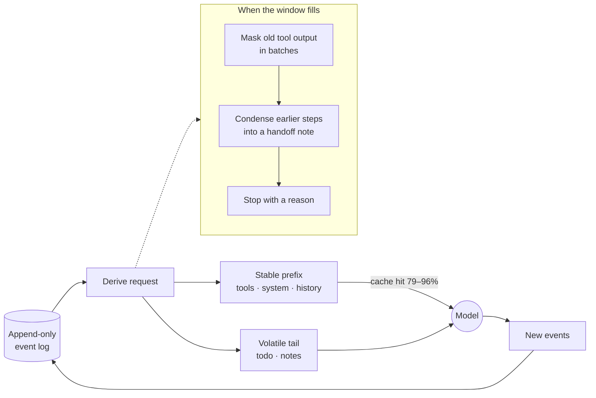

- **The prefix never moves.** Because a request is *derived* from an append-only log, everything before the newest step is byte-identical to the last request — exactly what provider caches reward. Volatile notes go at the end and stay where they were sent, so OpenAI's cache grows with the conversation (measured cached tokens per step: **14.1K → 16.6K → 19.1K → 21.7K**, where it used to sit flat at the 13.9K static prefix).
- **Every provider's cache, used properly.** Explicit `cache_control` on Anthropic (tools and system for an hour, the conversation for five minutes); `prompt_cache_key` and sticky routing on OpenAI/OpenRouter; DeepSeek, Kimi and Z.AI implicit caching kept warm.
- **Masking is batched.** Every mask breaks the cache once, so stale tool output is folded only past half the window, capped, and in batches — measured to be the difference between saving money and spending it.
- **Zero-token scaffolding.** App templates copy in as files, skills load only when selected, the codebase index is queried and never pasted, and widget specs are fetched on demand — the model pays for what it uses.
- **Spend you control.** Per-session cost and token ceilings (sub-agents count toward them), estimated vs billed cost kept apart, and a cost ceiling printed before any evaluation run.

## 🧭 Long-horizon runs

Long jobs fail in two ways: they run out of window, or they quietly forget what
you asked. AICO measures each next request from the provider's own token count
and, cheapest first:

1. **masks** older tool output behind a note of what was there and where the full text is saved — the newest results stay whole;
2. **condenses** earlier steps of the running turn into a handoff note — your messages **word for word**, the plan and whether you approved it, the todo list and every file read or changed, taken from the record rather than trusted to a summary. An earlier note's sections are carried forward, not re-summarised, so the fifth condensation still has your original request;
3. **stops with a reason** if a single step is larger than the window, instead of summarising in a loop.

Plus: **steer a run mid-flight** (delivered at the next step boundary, nothing lost), durable queues that survive a crash, background agents and scheduled jobs under one supervised work ledger, and dev servers detected and backgrounded so nothing holds a turn hostage. Measured: **140/140 values correct, every turn `completed`, peak context 201K → 115K**. [Full results →](benchmarks/long-horizon/README.md)

## 🛠 Software engineering proof

| Probe | Result | What it shows |
|---|---|---|
| [**SWE-bench Lite**](benchmarks/swebench-lite/README.md) — real GitHub issues from 12 open-source repos, graded by each project's own tests | **73 / 80 resolved (91.25%)** — two disjoint random draws, 35/40 then 38/40 | Fixing real bugs in large, unfamiliar codebases from the issue text alone — django 29/31, sympy 17/19, scikit-learn 6/6, matplotlib 5/5, pytest 4/4, sphinx 3/3 … |
| [**Custom-stack architecture**](benchmarks/custom-app-architecture/README.md) — ambiguous greenfield briefs, no template | **4 / 5 built clean (17/17 checks each)**; the fifth hit a real iteration cap at 60% | Deciding the data model, stack and boundaries — not just filling in a template |
| **Hidden-test implementation** — a spec, 7 visible tests, graded by 23 it never saw | **23 / 23** on both gpt-5.6-luna and gpt-5.6-terra | Implementing to a spec, not to the visible tests |
| **Nine Node app templates** — each built end to end by a real model | **9 / 9 proven live**, opened in a browser at two widths | The app platform works as a whole |
| **Five more starters** — FastAPI, Spring Boot, ASP.NET Core, Go, Laravel — each built, tested, audited and run as a container | **61–74 checks each**, 95–98% test coverage, dependency audit clean, container smoke test green | The starters hold up in their own ecosystems (these were verified by running them, not by a model build) |
| [**Engineering benchmark**](scripts/eng-bench.mjs) (`npm run bench:eng`) — multi-tenant API with JWT/RBAC, a bug in an unfamiliar codebase, a pattern refactor, an architecture doc, a full-stack feature, delegated security fixes; independent graders and black-box checks | **≈99 / 100 checks** on `deepseek-flash` for **≈$0.35 a full run**; delegation 12/12 | The everyday enterprise work, measured on every prompt or tool change — a skill that bloated output was caught and removed before release |

Every one is reproducible from scripts in this repository, with per-instance
evidence committed. SWE-bench was run blind — no dependency install, no local
test runs — with `deepseek-v4-flash`, one of the cheapest capable models; it is a
self-run probe, not a leaderboard entry, and the [caveats](benchmarks/swebench-lite/README.md)
say exactly what that means.

In the desktop app the same agent works on **your** GitHub: review a pull request,
fix a failing check, diagnose a broken Action — through the `gh` CLI you already
use, never with a force-push.

---

## 🏗 Architecture

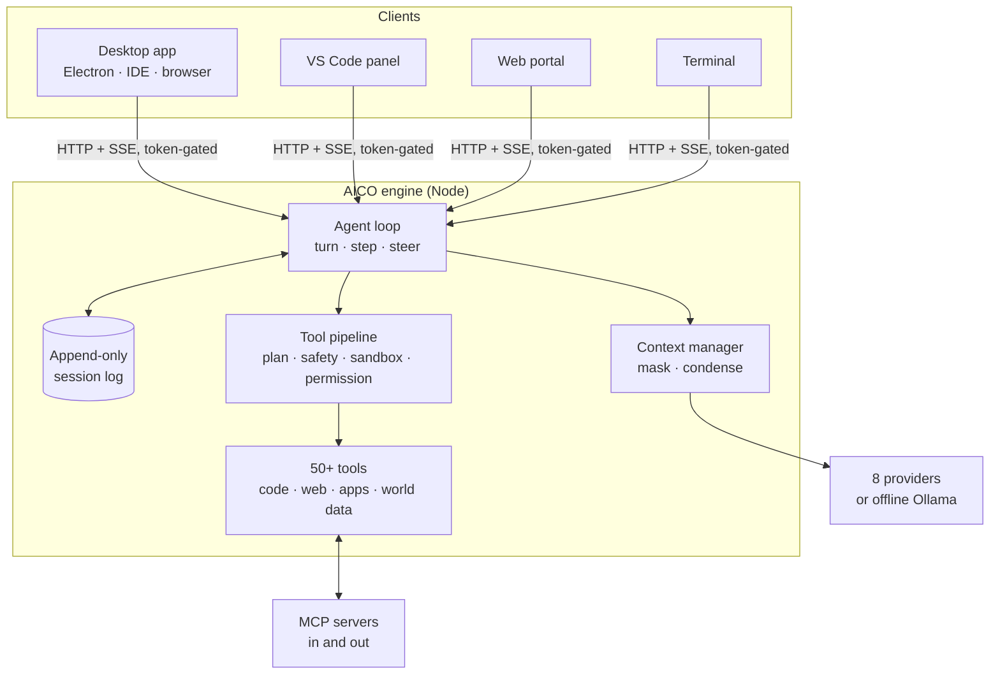

- **One engine, four clients.** The desktop, VS Code and the web portal share one state layer and one renderer; the desktop is a client, not a fork.
- **Turn / step.** A step is one model request plus its tool calls; a turn is zero or more steps; both are durable events, and turns end with a structured reason (`completed | max-tokens | blocked | aborted | error`).
- **Tool pipeline.** Policy runs as ordered stages — hooks, plan mode, bash safety, sandbox, permission — where guards can only *deny*. Parallel-safe calls run in a pool; results commit **in model order**, so a step replays identically.
- **MCP both ways.** Connect any MCP server; AICO is itself an MCP server another AI can hand work to. The desktop exposes the whole IDE and its browser to the agent the same way (`ide_*`, `browser_*`).

---

## 🚀 Install & quick start

```sh
npx github:suhail-akhtar/aico#v0.47.0 serve     # web portal, nothing to install
npm install -g github:suhail-akhtar/aico#v0.47.0 # `aico` on your PATH (VS Code needs this)
```

```sh
aico provider add                      # interactive setup
aico                                   # terminal chat
aico -p "fix the failing tests"        # one-shot
aico -c                                # continue the last session
aico --agent review -p "review my diff"
```

`#v0.47.0` pins a release, `#release/v0.47` follows its fixes, `#main` is the
trunk. From source: `git clone … && npm install && npm run build && npm run build:web`.
Requires **Node 22.5+** (built-in SQLite).

### Providers

| Provider | Key | Notes |
|---|---|---|
| **OpenAI** | `OPENAI_API_KEY` | Responses API for gpt-5.6/gpt-6 (tools + reasoning together); image generation |
| **Anthropic** | `ANTHROPIC_API_KEY` | Explicit `cache_control` for ~90% input savings |
| **Google Gemini** | `GEMINI_API_KEY` | Widest input surface (image, audio, video) |
| **OpenRouter** | `OPENROUTER_API_KEY` | Any model; sticky routing keeps caches warm |
| **DeepSeek** | `DEEPSEEK_API_KEY` | V4; cache hits at 1/50 of a miss; the model behind the benchmarks |
| **Moonshot Kimi** | `MOONSHOT_API_KEY` | K3, K2.7 Code, K2.6; reasoning replayed |
| **Z.AI (GLM)** | `ZAI_API_KEY` | Implicit caching; Coding Plan endpoint |
| **Ollama** | *(none)* | Local, free, private — fully offline |

The model name picks the provider (`aico -m glm-4.6` goes to Z.AI). Keys live in
`~/.aico/settings.json` (`aico provider add` or Settings → Models, where each
provider's models are a searchable list and *Test* checks which ones read images).

---

## 🔍 Deep dive

<details>
<summary><b>It checks its own work — <code>VerifyApp</code></b></summary>

Three models were once asked for a single-file 3D planner and a keyword check
scored two of them 12/12. Opened in a browser, one threw on load and the other
was a shell. Nothing had ever *run* the artifact.

`VerifyApp` opens the page in a real browser and reports what a person would hit:
uncaught exceptions, console errors, failed requests, what rendered (including
whether a `<canvas>` was ever painted) and whether named controls do anything.

```
FAILED — file:///…/index.html has 3 problem(s). This artifact is not finished.
  - uncaught: THREE is not defined
  - 1 of 1 canvas element(s) were never drawn to
  - "brand colour picker" does not work: set a new colour, and nothing changed
```

The verdict is not advisory: a turn that produced a web page cannot end
`completed` until a passing verdict exists for the file *as it stands now*. The
requirements are read out of **your** words, not the model's — a model that
writes its own acceptance criteria writes ones it has met. Flows (sign in, add a
customer) are checks with steps and expectations; screenshots are shown back to
models that read images.

</details>

<details>
<summary><b>Steering, planning and running things</b></summary>

- **Steer mid-run.** Type while it works; the message lands at the next step boundary and the turn is extended, not cancelled. Queues are durable across crashes.
- **Plan first.** Plan mode removes the write tools entirely; the agent investigates and proposes a structured plan you can *Go ahead*, *Amend*, save for *Later* or *Decline*. Assumptions appear above the steps.
- **Bash is one-shot; servers go to the background.** Dev servers, watchers and tails are detected and backgrounded with their pid and URL. Nothing runs forever — a backstop wraps every tool dispatch (this replaced a 139-minute hang).
- **`Terminal` remembers** its directory and environment between calls. **`Read` before `Edit`** is enforced, not requested.

</details>

<details>
<summary><b>Apps — build real applications, not snippets</b></summary>

Eighteen templates. Nine for Node — a records page over SQLite, a landing page, a Hono JSON API, a
Next.js app with accounts, a metrics dashboard, a docs site, a CLI, an LLM agent
service and an Expo mobile app — plus starters for Python (FastAPI), Java (Spring Boot), C# (ASP.NET Core), Go and PHP (Laravel) and a React frontend, plus three full-system bundles (small: React + FastAPI + Postgres behind Traefik and Keycloak; medium: Spring Modulith API, worker, outbox, audit, React, flagd, object storage; large: Helm, kustomize, Terraform, Argo CD or Flux and OpenTelemetry for the medium app), copy in as files (zero model tokens) with a worked
feature, tests, notes for the agent, a backlog and a deploy script. Or a custom
stack from a description. The turn cannot end until the app was opened in a real
browser and its own checks are green; **Deploy** runs the script it ships with. A
conversation bound to an app shows a live preview at desktop, tablet and phone
widths, the backlog, decisions, files and logs.

</details>

<details>
<summary><b>Skills, agents and learning</b></summary>

- **Skills** are Claude-compatible folders (`SKILL.md` + scripts, references, templates) — import, export, write, or ask the agent to create or improve one. `aico skill eval` scores a skill against tasks with known answers; `aico skill optimize` proposes edits and keeps only what scores **strictly higher on validation tasks the optimiser never saw**.
- **Agents** — 17 built in (review, security-audit, architect, qa, devops…) plus your own with their own tools, skills, model, knowledge and scripts. `Task` spawns sub-agents that **inherit every constraint** of their parent — plan mode, sandbox, spend caps.
- **It learns, with you as the gate.** Ratings with notes, mid-turn corrections and repeated errors become *proposals* you keep or dismiss; kept ones become knowledge shown on later tasks whose wording matches.

</details>

<details>
<summary><b>Safety — layered, and honest about what each layer enforces</b></summary>

| Layer | What it does |
|---|---|
| **Permissions** | Mutating tools ask first (with a diff preview), or auto / ask-before-edits / ask-every-time per message |
| **Bash safety classifier** | Blocks `rm -rf /`, `mkfs`, `curl \| bash`, shell-profile writes, credential exfiltration and ~40 more patterns |
| **Plan mode** | Read-only tools only — inherited by sub-agents |
| **Sandbox** (opt-in) | `workspace-write` / `read-only`: **full** for AICO's own file tools, **partial** for spawned processes (says so) |
| **Repeat guard** | Detects a model looping on identical calls and makes it change approach |
| **Spend caps** | Per-session cost and token ceilings, sub-agents included |
| **Network surfaces** | The server binds to `127.0.0.1` with a startup token; the desktop never hands the token to page code |

Not a sandbox for untrusted code — review what it runs.

</details>

<details>
<summary><b>VS Code</b></summary>

A native panel in the Secondary Side Bar that shares the web client's state
layer and renderers. Edits arrive as `WorkspaceEdit`s (so <kbd>Ctrl</kbd>+<kbd>Z</kbd>
and Source Control work), it knows your active file, selection and Problems, and
the editor is a tool: `VSCodeDiagnostics`, `VSCodeTasks`, `VSCodeReferences`,
`VSCodeRename`, `VSCodeFormat`. Install the `.vsix` from the
[release](https://github.com/suhail-akhtar/aico/releases/latest) and reload the window.

</details>

<details>
<summary><b>Configuration</b></summary>

`~/.aico/settings.json` (global) merged with `.aico/settings.json` (project):

```jsonc
{
  "model": "gpt-5.6-terra",
  "providers": { "openai": { "reasoningEffort": "high" } },
  "autoCompact": { "thresholdPercent": 75, "keepRecentTurns": 3 },
  "contextManagement": { "keepRecentToolResults": 6, "midTurnCompaction": true, "reciteTodos": true },
  "promptCaching": { "prefixTtl": "1h" },
  "sandbox": { "mode": "workspace-write" },
  "safetyLimits": { "maxCostPerSession": 5.00 },
  "imageGeneration": { "provider": "openai", "model": "gpt-image-1", "quality": "low" },
  "mcpServers": { "playwright": { "command": "npx", "args": ["@playwright/mcp"] } }
}
```

Everything outside a project lives under `~/.aico`; set `AICO_HOME` to move it.
Full reference: **[GUIDE.md](GUIDE.md)**.

</details>

<details>
<summary><b>Testing</b></summary>

```sh
npm test                    # 3,200+ offline engine assertions, no key needed
npm run test:web:unit       # web renderers and reducers
npm --prefix desktop test   # desktop units
npm run test:live           # live assertions against a real model — costs money
node scripts/long-horizon-live.mjs deepseek-flash default 30
```

The live suite covers what a mock cannot: wire formats, streaming, tool round
trips, prompt caching, truncation, cancellation, steering, compaction, sandbox
confinement and sub-agent inheritance. Session logs carry runtime invariants
(ordering, turn balance, call/result pairing) asserted by every test that
produces one. Tests never touch your real `~/.aico`.

</details>

<details>
<summary><b>Honest limitations</b></summary>

- **Shell commands are confined by reading them, not by a jail.** AICO's own file tools are confined by real path; a shell command that writes outside the project, downloads or installs a program asks you first (in every mode), but a write made inside a program it runs (a script, `node -e …`) is not seen.
- **Verification covers the web.** A CLI, a library or a server has no browser gate; its checks are the tests the agent ran.
- **Desktop builds are not code-signed yet**; there is no macOS build yet.
- **Map data is OpenStreetMap** — real places, hours and phones, but no ratings or photos, and thin in some regions.
- **The VS Code extension is a `.vsix`**, not a Marketplace listing yet.
- **Benchmarks are self-run** with published evidence, not independently audited.

</details>

---

## 🤝 Contributing & development

```sh
npm ci && npm --prefix web ci && npm --prefix desktop ci
npm run dev                  # engine, watch mode
npm --prefix desktop start   # build and run the desktop app
npm test
```

Design decisions live in the module headers next to the code they govern
(`src/session/`, `src/registry/`, `src/sandbox/`, `desktop/DESIGN.md`) rather
than in a document that drifts. Issues and pull requests are welcome.

**Standards.** Anyone changing the code — person or AI agent — follows
[AGENTS.md](AGENTS.md) and the engineering standards in
[docs/engineering/](docs/engineering/README.md) (principles, architecture,
testing, security, releasing, and the [decision records](docs/engineering/adr/README.md)).
`node scripts/install-hooks.mjs` installs the commit and push checks;
`npm run check:standards` runs them; releases go through `npm run release`.
See [CONTRIBUTING.md](CONTRIBUTING.md).

## License

AICO is **source-available** under the
[Functional Source License, Version 1.1, ALv2 Future License (FSL-1.1-ALv2)](LICENSE)
© Suhail Akhtar: free to use, change and run — including inside a company — for
anything except building a competing product or service; each release becomes
Apache 2.0 two years after it ships.

- ✅ **Free for any use except a Competing Use**: personal, study, research,
  internal company use, client work and professional services around AICO.
- ❌ **No competing product or service** — making AICO (or something that
  substitutes for it or does substantially the same) available to others in a
  commercial product or service needs a separate licence from the author
  ([open an issue](https://github.com/suhail-akhtar/aico/issues)).
- 🔗 **Forks and copies keep the licence**: include the `LICENSE` file (or a
  link to it) and leave the copyright notices in place.
- ⏳ **Each version turns into Apache 2.0** on the second anniversary of the day
  it was made available.

FSL-1.1-ALv2 applies from 0.48.0. Releases 0.28.0 to 0.47.x remain under the
PolyForm Noncommercial License 1.0.0, and releases before 0.28.0 under the MIT
License; earlier versions are not relicensed.
