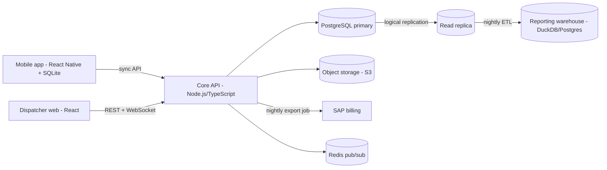

# FieldOps — Design

Sample document for the grader self-test: it should pass every mechanical rubric check.

## 1. Context and requirements

FieldOps serves about 10,000 users: 9,000 technicians on Android and iOS, 800 dispatchers and office staff on desktop browsers, and 200 managers. Technicians work offline for hours and must still read their jobs, complete inspection forms with photos, record parts and capture signatures. Dispatchers need a live board that updates within five seconds. Managers need daily, weekly and monthly reporting that must not load the operational database. Completed jobs flow to SAP for billing in a nightly batch. Everything is retained for 7 years.

Load estimate: 15,000 jobs per day, each with roughly 6 photos of 2 MB, gives about 180 GB of photos per day, roughly 65 TB per year and about 460 TB across the 7-year retention window. Structured data is small by comparison: around 15,000 job rows and perhaps 300,000 form-field rows per day, under 50 GB per year. Peak traffic is the morning sync burst, when up to 9,000 devices pull their day's jobs within 30 minutes: about 5 requests per second on average, with bursts of 200 requests per second. The dispatch board holds up to 800 concurrent WebSocket connections, and location pings from 9,000 technicians every 60 seconds are about 150 writes per second.

## 2. Architecture overview and components

Components:

- **Mobile app** (React Native, TypeScript): an offline-first client with a local SQLite store, an outbox of pending operations, and background sync when connectivity returns. Photos are written to device storage and uploaded separately from job data.
- **Core API** (Node.js with Fastify, TypeScript): authentication, jobs, forms, the sync endpoints and the dispatcher endpoints. Stateless and horizontally scaled behind a load balancer.
- **Realtime gateway**: WebSocket connections for the dispatch board; fan-out via Redis pub/sub so any API instance can publish a technician status change.
- **PostgreSQL**: the operational system of record.
- **Object storage (S3)**: photos and signatures, uploaded directly from devices using pre-signed URLs, with lifecycle rules for retention.
- **Reporting**: a read replica plus a nightly ETL into a reporting schema, so manager queries never touch the primary.
- **SAP connector**: a nightly batch job exporting completed jobs idempotently, with reconciliation.

## 3. Data model

- `technician(id, name, region_id, status, last_location, updated_at)`
- `job(id, customer_id, site_id, assigned_technician_id, status, scheduled_for, version, updated_at, deleted_at)`
- `inspection_form(id, job_id, template_id, answers_json, version, completed_at)`
- `photo(id, job_id, form_id, object_key, sha256, taken_at, uploaded_at)`
- `signature(id, job_id, object_key, signed_by, signed_at)`
- `part_usage(id, job_id, part_sku, quantity, recorded_at)`
- `sync_operation(id, device_id, entity, entity_id, base_version, payload, received_at, outcome)` — the server-side log of every offline change, which is also the audit trail.
- `sap_export(id, job_id, batch_date, status, sap_document_id)`

Every mutable row carries a `version` integer and `updated_at`; deletes are tombstones (`deleted_at`) so offline clients learn about them.

## 4. Offline sync and conflict resolution

Clients record changes as operations in a local outbox, each tagged with the `version` they were based on. On sync the server applies operations in order. If the base version matches, the change applies and the version increments. If it does not, there is a conflict, resolved field by field: dispatcher-owned fields (assignment, schedule) are server-wins; technician-owned fields (form answers, parts, signature, completion) are client-wins because the technician observed them on site. Conflicts that touch the same technician-owned field from two devices are kept as both values and flagged for a dispatcher. We rejected CRDTs: they handle concurrent text editing well, but our conflicts are about ownership of fields, and the team has no CRDT experience. We also rejected plain last-write-wins, because a dispatcher's re-assignment could silently overwrite a completed inspection.

## 5. Real-time updates

The dispatch board uses WebSockets. Technician status and location changes are published to Redis pub/sub channels per region; the gateway pushes them to subscribed dispatchers. Server-sent events would also work for this one-way feed, but dispatchers also acknowledge assignments from the board, so a single duplex connection is simpler. Polling was rejected because 800 boards polling every 2 seconds is 400 requests per second for mostly unchanged data.

## 6. Reporting and analytics

Manager reports run against a read replica for daily views and a nightly ETL into a star schema (job facts, technician and date dimensions) for weekly and monthly SLA compliance and first-time-fix rate. Materialized views refresh after the ETL. This keeps heavy aggregation off the primary. A full warehouse such as Snowflake or BigQuery was considered and rejected for version one on cost.

## 7. Technology stack and justification

| Area | Choice | Why | Alternatives rejected |
|---|---|---|---|
| Mobile | React Native + TypeScript | One codebase for Android and iOS; the team already knows TypeScript | Native Kotlin/Swift (two teams), Flutter (Dart is new to the team) |
| Local store | SQLite (via op-sqlite) | Mature, transactional, works offline | Realm (vendor lock-in) |
| API | Node.js + Fastify + TypeScript | Shared types with the clients; team skills | Java/Spring (slower for this team), Go |
| Database | PostgreSQL | Relational integrity, JSONB for form answers, logical replication | MongoDB (weaker for reporting joins) |
| Files | S3 with lifecycle rules | Cheap at 460 TB; Glacier tiers for old photos | Storing photos in the database |
| Realtime | WebSockets + Redis pub/sub | Low latency, horizontal fan-out | Polling, MQTT broker (extra infrastructure) |
| Reporting | Read replica + nightly ETL | Cheap, isolates load | Snowflake (cost), querying the primary |

## 8. Security, compliance and retention

Single sign-on for office staff, device-bound refresh tokens for technicians, encryption at rest for the device database and S3. Retention: S3 lifecycle moves photos older than 90 days to an infrequent-access tier and after 1 year to Glacier Deep Archive, keeping them for 7 years; database rows are partitioned by month and archived to cold storage after 2 years, still queryable for audits.

## 9. SAP integration

A nightly batch exports completed jobs to SAP through its existing IDoc interface. Each export is idempotent (keyed by job id), failures are retried with backoff, and a reconciliation report compares SAP documents with exported jobs every morning.

## 10. Trade-offs

- Field-level ownership rules are simpler than CRDTs but need careful definition per field and per form template.
- A nightly reporting ETL means reports are up to a day old; managers accepted daily freshness, and the live board covers same-day operations.
- React Native trades some native performance and camera control for one codebase.
- One PostgreSQL primary is a scaling ceiling, but 150 writes per second is far below it.

## 11. Risks and mitigations

| Risk | Mitigation |
|---|---|
| Sync bugs corrupt job data | Server-side operation log, property-based tests of the conflict rules, staged rollout to one region |
| Photo uploads fail on poor networks | Resumable multipart uploads, separate from job sync, retried in the background |
| SAP interface changes | Contract tests against an SAP sandbox; the export is isolated behind one module |
| Six months is tight | Cut scope to core flows; reporting v1 uses the replica only |
| Storage costs grow with 460 TB of photos | Lifecycle tiers, client-side compression to 1 MB |

## 12. Phased delivery plan

- **Phase 1 (months 1-2):** core API, PostgreSQL schema and migrations, mobile app with offline job list and forms, sync with conflict rules, photo uploads. Pilot with 50 technicians.
- **Phase 2 (months 3-4):** dispatcher web board with WebSockets, assignment flows, signatures and parts, SAP nightly export with reconciliation.
- **Phase 3 (months 5-6):** reporting via replica and ETL, retention lifecycle rules, hardening, load testing at 2x the morning burst, rollout region by region.

Each phase ends with a release to production for a growing group of users, so the riskiest piece — offline sync — is proven in month 2, not month 6.
