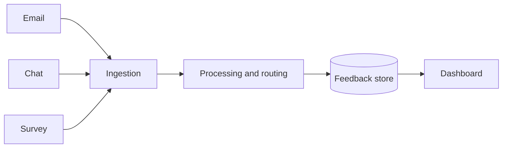

# Technical Proposal: Customer Feedback Platform

## 1 Executive Summary

Northwind Analytics (the "Supplier") proposes to design, build and operate a customer feedback platform for Contoso Retail (the "Client"). The platform will collect feedback from every channel into one place, route it to the right team within **15 minutes**, and give managers a live view of what customers are asking for. We have delivered three comparable platforms since 2022, and we will reuse the proven ingestion layer described in Section 4.2 to keep the build to **14 weeks** and the first-year cost to £412,000 [1].

Our approach is deliberately incremental: a pilot with two teams in week 6, a phased rollout across all 38 stores by week 12, and a hand-over to the Client's own operations team in week 14 once the Service Level targets in Table 2 have been met for four consecutive weeks.

## 2 Scope

The scope covers ingestion of email, chat, survey and in-store kiosk feedback; automatic tagging and routing; a reporting dashboard; and integration with the Client's existing CRM. It dose not include changes to the Client's point-of-sale systems, which remains the responsibility of the Client's IT department, nor the migration of historical feedback older than 24 months.

- Ingestion of four channels: email, chat, survey and kiosk
- Tagging and routing rules agreed with each team
- A reporting dashboard for store and regional managers
- CRM integration through the Client's published API ([docs](https://api.contoso.example/docs))

```callout warn
**Assumption**
we assume the Client will provide test accounts for the CRM by week 2, if they are late the integration work moves back by the same amount of time.
```

## 3 Responsibilities

| Activity | Supplier | Client |
| --- | --- | --- |
| Requirements workshops | R | A |
| Platform build | R, A | C |
| CRM test accounts | I | R, A |
| User acceptance testing | C | R, A |
| Go-live approval | I | A |

## 4 Solution Architecture

### 4.1 Overview

The platform is made of four parts: channel connectors that receive feedback, a processing service that tags and routes each item, a data store, and the dashboard. Each part can be scaled on it's own, so a spike in survey responses never slows down the dashboard.



### 4.2 Ingestion

The ingestion layer is the one we built for three previous clients [2]. It accepts messages over HTTPS and from a mail gateway, validates them, and places them on a durable queue so that nothing is lost if the processing service is restarted.

## 5 Service Levels

| Measure | Target | Measured |
| --- | --- | --- |
| Availability | 99.9% | Monthly |
| Routing time | 15 minutes | Per item |
| Dashboard refresh | 5 minutes | Continuous |
| Support response | 4 hours | Per ticket |

Table 2 shows the targets the platform will be measured against from go-live.

## 6 Delivery Plan

```chart
{
  "title": { "text": "Feedback items processed per week (pilot forecast)" },
  "tooltip": { "trigger": "axis" },
  "xAxis": { "type": "category", "data": ["Week 6", "Week 7", "Week 8", "Week 9", "Week 10"] },
  "yAxis": { "type": "value" },
  "series": [{ "name": "Items", "type": "bar", "data": [1200, 1850, 2400, 3100, 3650] }]
}
```

The pilot forecast above assumes two teams in week 6 and four teams from week 8.


## 7 Commercials

The total first-year cost is £412,000, made up of £296,000 for the build and £116,000 for twelve months of operation and support. Payment is due in three milestones as described in Section 7.2 of the commercial annex.

## References

[1] Northwind Analytics, *Feedback Platform Cost Model v3*, March 2026.
[2] Northwind Analytics, *Ingestion Layer Design*, internal document, 2024.
