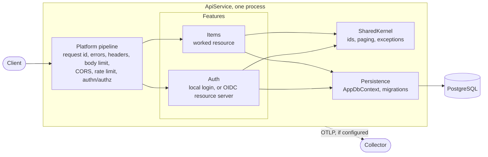

# Architecture

One deployable, one project, organised by **feature**. It is small on purpose and built so that growing it is
moving files, not untangling them. Three stages, and what to add at each.

Dependency rules, enforced by `tests/ApiService.Tests/ArchitectureTests.cs` (a violation names the type):

| Rule | Why |
|---|---|
| `SharedKernel` depends on nothing in the app | the bottom layer; every feature may use it |
| `Platform` knows no feature and no persistence | cross-cutting; features plug into it |
| a feature never references another feature | each feature can be lifted out whole |
| entities have no ASP.NET Core types | the domain rules run anywhere (a job, a test) |
| endpoints do not touch `Persistence`; services do not touch `Microsoft.AspNetCore.Http` | HTTP translates, services decide |
| concrete classes are sealed; only request DTOs and `Program` are public | small public surface |

Patterns used because they pay off here: a **service layer** (use cases callable without HTTP), **DTO mapping by
hand** (a mapper library earns nothing at this size), **keyset pagination**, **UUIDv7 ids**, **one exception
handler** (RFC 9457), **one composition root**, **options validated at startup**. `AppDbContext` is already a
repository and a unit of work, so no wrapper sits on top of it. Not used: CQRS, event sourcing, a mediator library,
a generic repository, AutoMapper.

## Stage 1: small (this repository)

One project, a handful of features, one database. Add features by copying `Features/Items`
(`docs/EXTENDING.md`). Stay here while one team owns the code and one deploy is fine.

## Stage 2: medium, a modular monolith

Same process, hard seams. When features multiply or teams split:

1. Split projects along the folders that already exist: `src/BuildingBlocks` (SharedKernel + the platform pieces
   worth sharing), `src/Modules/Items/{Items.Contracts,Items.Core}`, `src/Modules/Auth/...`, `src/Host`
   (Program.cs, Platform). The architecture tests become project-reference rules; move them as you go.
2. A module exposes only its **Contracts** (interfaces and DTOs another module may use). `Core` stays internal.
   Cross-module calls go through a Contracts interface, or through in-process messages when they are
   asynchronous by nature.
3. Each module owns its tables, its `DbContext` and a Postgres **schema** (`HasDefaultSchema("items")`), with its
   own migrations history table. No joins across modules; reference by id.
4. Add the outbox pattern for messages that must not be lost, then a message bus library (Wolverine is MIT;
   MediatR 14 and MassTransit 9 carry commercial or reciprocal licences, check before adopting anything).
5. Add `Asp.Versioning.Http` when a published contract must change without breaking clients.
6. Introduce `Microsoft.FeatureManagement` for flags and a real queue for background work.

## Stage 3: large, enterprise

Only where the evidence says so (separate scaling, separate teams, different release cadences):

1. Extract a module to its own service **at the seam you already have**: its Contracts become an HTTP/gRPC API or a
   topic; its schema becomes its own database. Do this one module at a time, for a reason you can measure.
2. Inside a module with real domain logic, adopt Clean/Onion layers (`Domain`, `Application`, `Infrastructure`,
   `Api`). Modules that are CRUD stay as they are.
3. Authentication moves to an identity provider (Keycloak, Entra); this service validates tokens only
   (`docs/EXTENDING.md`).
4. Add .NET Aspire (or compose plus a service-defaults project) for local orchestration, a gateway for routing and
   edge policy, distributed rate limiting (Redis), and per-tenant data isolation if you serve tenants.
5. Operate it: `/readyz` and `/healthz` as probes, `ApiService --migrate` as a pre-deploy job, the OTLP collector
   for traces and metrics, SBOM and signed images in the release pipeline.

## Request flow

`Client -> Kestrel (body and header limits) -> forwarded headers (if trusted) -> request id -> exception handler
-> status pages -> security headers -> body-size guard -> CORS -> rate limiter -> authentication -> authorization
-> endpoint filter (validation) -> handler -> service -> AppDbContext`. The order is in
`Platform/PlatformExtensions.UsePlatform`, with a comment per step; it is a security property, so change it with
tests.
