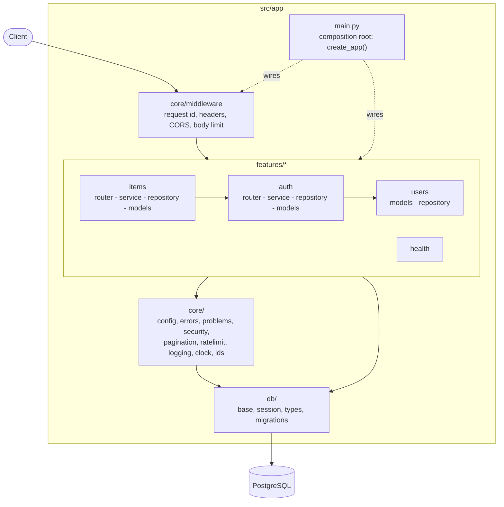

# Architecture

A layered service shaped so it can grow into a modular monolith without a rewrite. The
shape is the same at every size; what changes is how much of the surrounding machinery you
add. Nothing below is built until you need it.

## The structure today

Arrows are imports. Three rules keep it honest, and `tests/unit/test_architecture.py`
fails the build when one is broken:

1. `core` and `db` (the shared kernel) never import a feature.
2. A feature uses another only through its package (`from app.features.users import User`),
   never its internals (`...users.models`).
3. No cycles between features.

### One request

1. **Middleware** assigns a request id (kept in the logs and the error body), enforces the
   body-size limit, answers CORS, and adds the security headers.
2. **Router** parses and validates the input into a schema (`extra="forbid"`, strict).
   It holds no logic.
3. **Dependencies** (`Depends`) supply the session, the clock, the current user and the
   rate limit. They read from the `Container` that `create_app` built once.
4. **Service** performs the use case, owns the transaction (`commit()`), and raises
   `AppError` subclasses for expected failures.
5. **Repository** runs SQL. Every query takes `owner_id`.
6. **Problem handlers** turn any `AppError`, validation failure or unexpected exception into
   `application/problem+json` (RFC 9457) with the request id and no internals.

### Where each concern lives

| Concern | Place | Testable without HTTP? |
|---|---|---|
| Rules and use cases | `features/*/service.py` | yes |
| SQL | `features/*/repository.py` | with a database |
| Wire format | `features/*/schemas.py` | yes |
| Time, ids, hashing, tokens | `core/clock.py`, `ids.py`, `security.py` | yes (a manual clock) |
| Wiring | `main.py`, `core/container.py` | n/a |

## Stage 1: small (one team, one database, a handful of resources)

This is the template as shipped. Run one container per replica behind a load balancer;
PostgreSQL managed or in compose.

Do add: more feature folders (copy `items`), indexes as the queries show up, `pg_stat_statements`,
backups with a tested restore, an error tracker, and a dashboard on the OTLP metrics.
Do not add: a message bus, a cache, CQRS, a second service.

## Stage 2: medium (several teams, real traffic, other systems depend on the events)

Add, in roughly this order, as each need appears:

- **An identity provider (OIDC)** instead of local passwords: already built in. Set
  `AUTH_MODE=oidc` (`core/oidc.py` verifies the provider's RS256 tokens,
  `features/auth/provisioning.py` creates users on first sight); then add roles from its claims
  and retire the local endpoints.
- **Keyset pagination everywhere and idempotency keys** on creating endpoints
  (`Idempotency-Key` header; store key + request hash + response for 24 h behind a unique index).
- **A transactional outbox**: write the event row in the same transaction as the data, and a
  worker publishes it. It is the only reliable way to publish events alongside a database
  write.
- **A job queue** (Taskiq or Celery with Redis/Valkey) in a second process from the same image
  (`command:` override), for work that must not be lost.
- **Redis/Valkey for rate limits and caching**: a new class behind the `RateLimiter` port, one
  changed line in `build_container`.
- **Import-linter contracts** to enforce module boundaries beyond the three tests here; per-module
  schemas in PostgreSQL; contract tests against the last released `openapi.json` with `oasdiff`.
- **Tracing across services**: it is already on once `OTEL_EXPORTER_OTLP_ENDPOINT` is set;
  add the collector and sampling.
- A **read replica** for reporting queries (a second engine in the container, a `ReadSession`
  dependency).

## Stage 3: large / enterprise (many teams, compliance, high availability)

- **Modular monolith first**: each feature exposes a narrow `api.py` (facade + events) and hides
  the rest; modules own their tables; cross-module calls go through the facade or events. Enforce
  with import-linter. Split a module into a service only along a boundary you have measured
  (load, ownership, release cadence), not in advance.
- **A gateway** (Envoy, Kong, a cloud API gateway) for TLS, global rate limits, authentication
  offload, WAF and request quotas, so the per-process limiter becomes a backstop.
- **Kubernetes** with the probes this template already serves (`/healthz` liveness, `/readyz`
  readiness), PodDisruptionBudgets, a `terminationGracePeriodSeconds` longer than
  `--timeout-graceful-shutdown` (20 s), HPA on CPU or request rate, migrations as a Job
  (the `migrate` service in compose is the model), secrets from a secret manager.
- **Event-driven integration** (Kafka, NATS, SNS/SQS) fed by the outbox; consumers idempotent.
- **Audit log**, tenant isolation (row-level security or schema-per-tenant), data retention and
  erasure jobs, mutation testing nightly on the domain modules, load tests (k6) on every
  merge to main, signed images with provenance (cosign, SLSA).

CQRS and event sourcing are deliberately absent. Add a separate read model only when the read
shapes genuinely diverge from the write shapes (reporting), and event sourcing only when the
audit trail or replay *is* the product.
