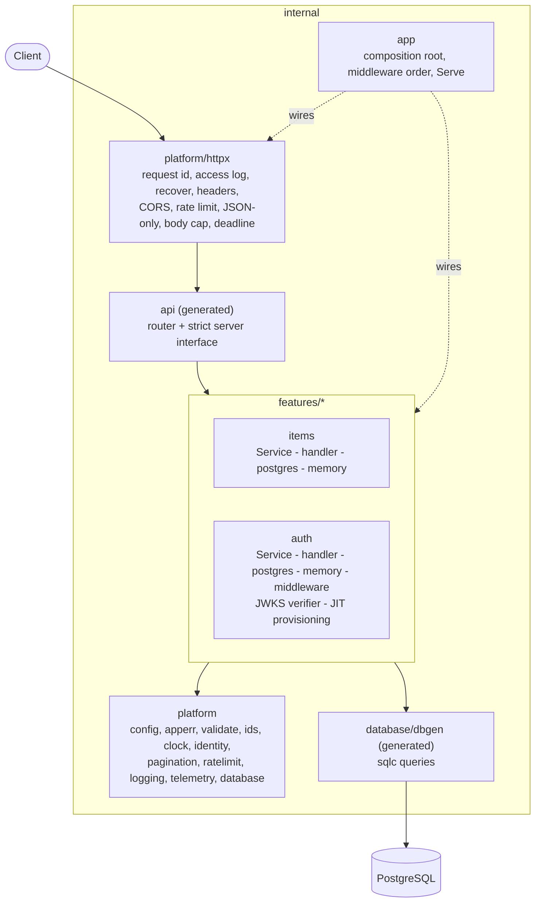

# Architecture

A layered service shaped so it can grow into a modular monolith without a rewrite. The shape is the
same at every size; what changes is how much of the surrounding machinery you add. Nothing below is
built until you need it.

## The structure today

Arrows are imports. The rules, each of which a reviewer (or you, in a test) can check with
`go list -deps`:

1. `platform` never imports a feature. A feature never imports another feature; they share only
   `platform/identity` (who is calling) and `platform/apperr` (what kind of failure).
2. The domain (`items.go`, `auth.go`) imports no HTTP and no SQL: it speaks to a `Repository`
   interface (the port) and to `apperr`/`validate`. `handler.go` and `postgres.go` are the adapters.
3. Only `internal/app` and `internal/cli` know concrete types. Dependencies are constructor
   arguments; there are no globals and no `init()` wiring.

### One request

1. **otelhttp** starts a span (a no-op until telemetry is configured); **RequestID** stores an id for
   the logs and the error body; **AccessLog** records method, path (no query string), status, bytes and
   duration; **Recover** turns a panic into a logged 500; **SecurityHeaders**, **CORS** (explicit
   allow-list), **RateLimit** (probes exempt; a stricter limiter on login and register),
   **RequireJSON** (415 for a non-JSON body), **MaxBody** and **Timeout** (a context deadline).
2. The **generated router** matches `METHOD /path` (Go 1.22 `ServeMux`) and the generated wrapper binds
   path and query parameters. The **auth middleware** runs next: every route is protected unless it is
   listed as public, and a test keeps that list equal to the `security: []` operations of the spec.
3. The **strict handler** decodes the JSON body into the generated request type. Request types contain
   only client-settable fields, so mass assignment is impossible by construction.
4. The **feature handler** reads the caller from the context, calls the **Service** (validation, ids,
   timestamps, rules) and returns a generated response type, or returns an error.
5. The **Repository** runs the sqlc query. Every query has `owner_id` in its `WHERE`.
6. **One error mapper** (`httpx.ErrorHandler`) turns `apperr` kinds, `validate.Errors`, an oversized body
   or any unexpected error into `application/problem+json` (RFC 9457) with the request id. Unexpected errors
   are logged with the real cause and shown to the client as a generic 500.

### Two ways to know who is calling

`auth.Service.Authenticate` is the only place a bearer token becomes a `Principal`, and it has two
modes chosen by `AUTH_MODE` at the composition root (`app.New`):

- `local` (default): the token is an opaque session issued by `POST /v1/auth/login`, looked up by its
  SHA-256 in `sessions`.
- `oidc` (resource-server mode): the token is an access token from an external identity provider.
  `JWKSVerifier` (`jwks.go`) checks signature (RS256 only, cached JWKS, rate-limited refetch on an
  unknown `kid`), `iss`, `aud`, `exp`, `nbf` and a UUID `sub`; `provision.go` then maps the `sub` to
  the `users` row (id = `sub`), creating it on first sight with `INSERT ... ON CONFLICT (id) DO NOTHING`
  so concurrent first requests cannot collide, and answers 409 when the email belongs to another account.
  `RejectLocalAuth` makes register, login and logout 404 before anything reads the request.

Both produce the same `identity.Principal`; features, handlers and the generated router do not know
which mode is on. The verifier is a port (`auth.TokenVerifier`), so tests inject the real one against an
in-process JWKS server (`internal/platform/oidctest`) and nothing needs a live identity provider.

### Where each concern lives

| Concern | Place | Testable without HTTP or a database? |
|---|---|---|
| Rules and use cases | `features/*/<feature>.go` (Service) | yes (memory repository, fake clock) |
| SQL | `db/queries/*.sql`, `features/*/postgres.go` | with PostgreSQL (`dbtest`: one schema per test) |
| Wire format | `api/openapi.yaml` and generated types | contract tests against the spec |
| Time, ids, hashing, tokens | `platform/clock`, `platform/ids`, `features/auth` | yes |
| Wiring | `internal/app`, `internal/cli` | yes (`app.New` takes `Options`) |

### Testing seams

`app.Options` is the one seam: production fills it with PostgreSQL adapters (`PostgresOptions`), the API
tests with the in-memory ones. The same repository contract suite runs against both, so the fake cannot
drift from the database. Integration tests use a schema per test on a shared PostgreSQL (`TEST_DATABASE_URL`),
not a container per test: it needs no Docker socket, so it runs inside the tools container and beside a CI
service container.

## Stage 1: small (one team, one database, a handful of resources)

This is the template as shipped. One container per replica behind a load balancer; PostgreSQL managed or
in compose; `docker compose up` in development.

Do add: more feature packages (copy `items`), indexes as the queries show up, `pg_stat_statements`, backups
with a tested restore, an error tracker, and dashboards on OTLP traces (set `OTEL_EXPORTER_OTLP_ENDPOINT`).
Do not add: a message bus, a cache, CQRS, a second service.

## Stage 2: medium (several teams, real traffic, other systems depend on your events)

Reach for these when a concrete problem asks for them, in this order:

- **Identity provider.** Replace local passwords with OIDC: `AUTH_MODE=oidc` is built in (JWT/JWKS verifier,
  just-in-time provisioning); keep `identity.Principal`. Add role or scope checks per feature, and remove the
  local credential endpoints and the `sessions` table once nothing uses them.
- **Rate limits at the gateway** (or a shared Valkey limiter): the in-process limiter is per replica and
  trusts only the peer address.
- **Transactional outbox + River** (PostgreSQL job queue, transactional enqueue) for events and background
  work: write the domain row and the outbox row in one transaction (`pgx.Tx` satisfies `dbgen.DBTX`, so an
  adapter can run in a transaction by constructing the repositories over it: add a small `WithTx` helper to
  `platform/database` when the first use case spans two repositories).
- **Idempotency keys** on `POST` routes that create money, orders or other side effects: a table keyed by
  `(owner, key)` storing the request hash and the response for 24 hours.
- **Metrics** (OpenTelemetry metrics or Prometheus) and database spans (`otelpgx`); a `traces` sampling policy.
- **oasdiff in CI** against the last released spec to refuse breaking changes inside `/v1`.
- **Per-account lockout / email verification / password reset** if you keep local accounts.
- A shared `libs/` module only when a second service needs the same code.

## Stage 3: large (many teams, strict compliance, independent deploys)

- **Split by measured seam, not by guess.** The feature packages already have explicit public surfaces
  (`NewService`, `NewHandler`, the repository interface); a feature that needs its own deploy moves to a
  `services/<name>` module in a `go.work` workspace with its own `api/openapi.yaml`, and the others call it
  through a generated client instead of an import.
- **Platform concerns move out**: TLS, authentication of callers, quotas and retries at an API gateway or
  mesh; secrets from a manager mounted as env or files; admission policies for the image (signed, scanned,
  SBOM attached; GitHub's `attest-build-provenance` gives SLSA provenance).
- **Data**: read replicas and a pooler (PgBouncer) in front of PostgreSQL; partition large tables; row-level
  security for tenancy; a documented backup/restore drill.
- **Delivery**: progressive rollout with SLO-based rollback, `oasdiff` and contract tests between services,
  a load test (k6) on every release candidate.
- **Not even then**: CQRS or event sourcing unless audit and replay are the product; microservices without a
  measured need.
