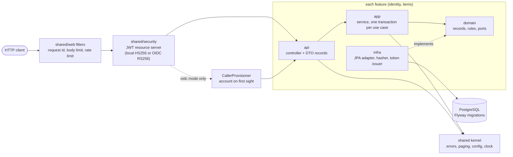

# Architecture

## Shape today: a small layered service with feature modules

- **Package by feature.** `items` and `identity` each own their API, use cases, domain and
  storage. `shared` is the kernel. `Application` is the composition root; Spring wires everything
  there, so no feature constructs another's objects.
- **Hexagonal edges.** The domain declares ports (`ItemRepository`, `PasswordHasher`,
  `TokenIssuer`); adapters in `infra` implement them with Spring Data, bcrypt and Nimbus. The
  domain is plain Java and tests without a container.
- **Rules are tests.** `ArchitectureTest` (ArchUnit) enforces the layer direction, the framework-free
  domain, JPA confined to `infra`, no field injection. `ModularityTest` (Spring Modulith) fails on
  module cycles and on reaching into another module's internals, and writes a PlantUML diagram to
  `target/spring-modulith-docs`.
- **One error path.** Domain code throws `DomainException` subclasses; `ProblemDetailsAdvice` turns
  every failure, including those raised in filters, into an RFC 9457 body.
- **Security by default.** Every route needs a token unless listed in `SecurityConfig`. Ownership is
  structural: repository methods take the owner.
- **Two ways to authenticate, one chain.** `APP_AUTH_MODE=local` (default): `identity` registers
  users and a local issuer signs HS256 tokens. `APP_AUTH_MODE=oidc`: the same filter chain verifies
  RS256 access tokens from an external provider (`OidcJwtDecoders`), and a `CallerProvisioner`
  (declared in `shared/security`, implemented by `identity`, so the kernel still knows no feature)
  creates the account row on first sight of a `sub`. Controllers and services cannot tell the
  difference: both put a verified `Jwt` whose `sub` is the account id in front of them.
- **One wire contract.** JSON is snake_case through a single Jackson naming strategy; lists are
  keyset-paged (`limit`, `cursor`, `next_cursor`) over `(created_at desc, id asc)`, the order of the
  `(owner_id, created_at desc, id)` index, so deep pages cost the same as the first.

Request path: request id -> body size limit -> rate limit -> JWT validation -> (oidc mode: account
provisioning) -> controller -> service (transaction) -> repository -> database; errors anywhere end
in `ProblemDetailsAdvice`.

## Growth path

| Stage | You have | Add |
|---|---|---|
| **Small** (this starter) | one deployable, one database, 2-5 features | nothing; keep features independent and run `make check` |
| **Medium** (several teams, one product) | a modular monolith | Spring Modulith events between modules with the persistent event registry (transactional outbox); roles or tenants from token claims (OIDC mode is built in; map them in `OidcAccountProvisioner`); `Idempotency-Key` on POSTs with side effects; a shared rate limiter (Redis or the gateway); read replicas or a reporting query side in the same database; per-module `@ApplicationModuleTest`; `oasdiff` in CI against the last released OpenAPI document |
| **Large / enterprise** | many teams, strict isolation | split a module into its own Maven module when a team needs compile-time isolation (`<app>-domain`, `<app>-app`, parent BOM); extract a service only at a measured seam, publishing its events over a broker; gateway for authentication, coarse limits and mTLS; tenant filters in repositories; mutation testing nightly; SLSA provenance and signed images; separate read model only where reads and writes truly diverge |

Not in the base on purpose: CQRS, event sourcing, a service mesh, a message broker. Each is a
step above, justified by a measured need.

## Where things are

| Concern | Place |
|---|---|
| New feature | copy `items/` (see `docs/EXTENDING.md`) |
| Cross-cutting HTTP behaviour | `shared/web`, registered in `shared/security/SecurityConfig` |
| Configuration | `application.properties` (mapping), `AppProperties` (validation) |
| Schema | `src/main/resources/db/migration` |
| API contract | generated by springdoc, checked by `OpenApiContractIT` |
