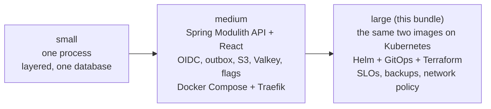
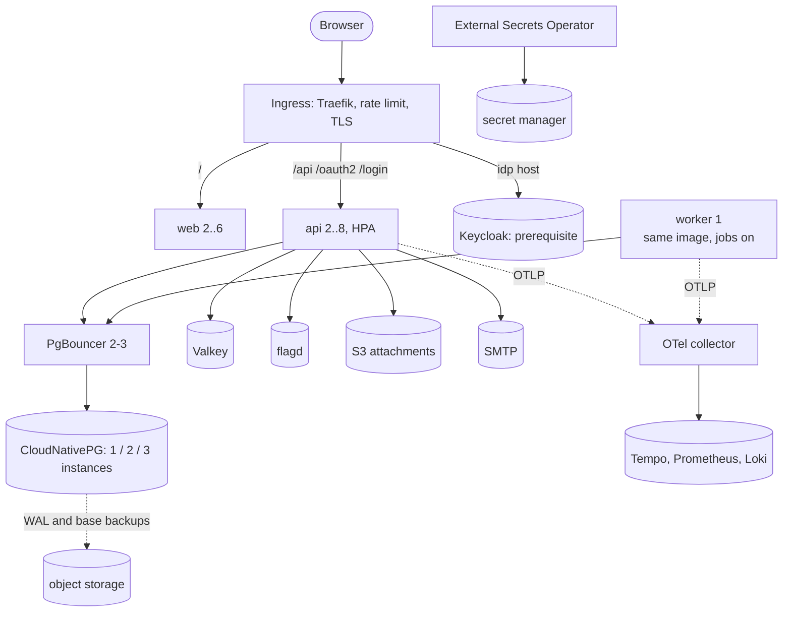

# Architecture

## Growth: small, medium, large

The application does not change between medium and large: same images, port 8080, `/healthz`
(liveness) and `/readyz` (readiness: database and Valkey). Large adds everything around it.

## Runtime

## What large adds

- **One chart, many workloads.** `services:` in values.yaml is the only place a workload is defined.
  Restricted pod security (non-root, read-only root, no capabilities, seccomp), probes, graceful
  drain, topology spread, HPA, PDB, ExternalSecret references (no values in git), a values schema.
- **NetworkPolicy matrix.** Default deny for the namespace; each workload gets exactly the ingress and
  egress it needs, asserted by helm-unittest. Platform pods (database, pooler, Valkey, flagd,
  Keycloak) get their ingress rules from `deploy/kustomize/base`.
- **Platform layer in kustomize.** Namespace with Pod Security labels, quota, limit range, a
  CloudNativePG cluster with PgBouncer and scheduled backups, overlays per environment.
- **GitOps.** Argo CD (App-of-Apps for operators, ApplicationSets per environment, two AppProjects) or
  Flux (sources, operators, per-environment releases). Automated sync in dev only.
- **Terraform.** `network`, `k8s`, `db`, `secrets` modules, two environments, providers locked,
  tflint and checkov configured with every skip justified.
- **Observability.** Collector config (Docker and Kubernetes), SLO recording and burn-rate alerts for
  the API (promtool unit-tested), platform alerts, Grafana provisioning and dashboards.

## What large deliberately omits

- **Keycloak, Valkey, flagd, S3 and SMTP are not deployed here.** They are prerequisites with their own
  lifecycles (operators or managed services). Only the policies that let the app reach them ship.
- **No service mesh, multi-cluster or multi-region.** One cluster per environment, single-region
  modules. Add them when a requirement names them.
- **No message bus and no microservice split.** The medium tier is a modular monolith with a database
  outbox and a worker; so is this. Extract a module only when scaling or ownership demands it.
- **No runbooks.** Alert `runbook_url`s point at `example.test`; write yours.
- **No Prometheus scrape of the API.** The medium image exports metrics over OTLP, not
  `/actuator/prometheus`, so the ServiceMonitor is off until you add a scrape endpoint.

## What is verified

`sh scripts/check.sh`: helm lint (strict) and template for six value sets, kubeconform (strict, with
CRD schemas) on every rendered manifest and every kustomize overlay, helm-unittest, terraform fmt and
validate, tflint with the AWS ruleset, checkov, collector `validate`, promtool check and unit tests,
yamllint, trivy config.

**Not verified:** that a cluster admits and runs any of it; `terraform plan` or `apply`; that the SLO
and alert metric names match what your Prometheus receives (they assume the OTLP to remote-write path
keeps the Micrometer names and `job="system-api"`); the Argo CD and Flux files beyond YAML and
schema; the dashboards against live data; backup and restore.
