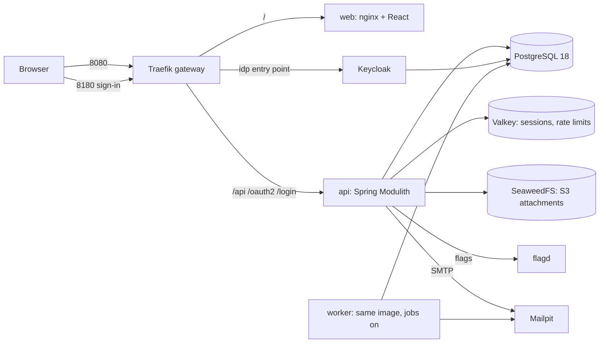

# Architecture

## The system

Sign-in is the OIDC authorization code flow with the API as the confidential client (a
backend-for-frontend): the API keeps the tokens, the browser only holds an HttpOnly `SESSION` cookie
(stored in Valkey, so any API replica can serve it) and sends `X-XSRF-TOKEN` on writes. Machine
callers use the `automation` client (client credentials) and send a bearer token.

Inside the API each feature is a Spring Modulith module with `api` / `app` / `domain` / `infra`
layers. Modules never reach into each other: `tasks` publishes `TaskCreated`, `TaskAssigned`, ...
and `audit` and `notifications` listen. The event is written to the event publication table in the
same transaction as the task (the outbox); delivery happens after commit, and an event whose listener
failed stays pending until the worker republishes it. Listeners record what they handled in the
`inbox`, so a repeated delivery does nothing.

## Growth stages

| Stage | Shape | You add |
|---|---|---|
| **small** | One service, one database, layered, local login or one OIDC provider | what the `api-service-*` starters give you |
| **medium (this)** | Modular monolith + SPA, gateway, identity provider, cache, object store, outbox + worker, audit, flags | more modules; more API/worker replicas; a managed PostgreSQL |
| **large** | Several deployables where a module has earned its own scaling or team: a broker (Kafka/NATS) replaces the in-database outbox hop, an observability stack, GitOps | extract a module along its event boundary; telemetry collector and dashboards; Kubernetes manifests; a secret manager |

Move up one step when a pain is measured, not before. The module boundaries and the outbox exist so
that extracting a module later means moving a package and swapping its event transport, not
rewriting it. Telemetry is already instrumented: set `APP_OTEL_ENABLED=true` and
`OTEL_EXPORTER_OTLP_ENDPOINT` to send traces, metrics and logs to a collector.

## Where things live

`services/api/src/main/java/com/example/system/`: `tasks`, `identity`, `audit`, `notifications`,
`shared` (errors, paging, config, web filters, storage, flags, jobs). `db/migration` holds the Flyway
scripts. `infra/` is configuration for the containers; `compose.yaml` wires them.
