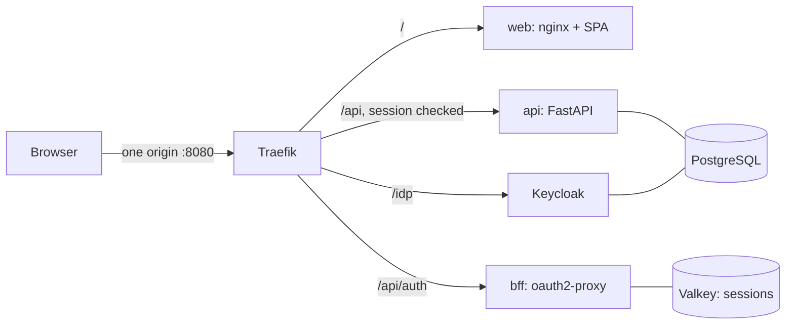

# __APP_TITLE__

A small full-stack system, ready to run: a React 19 web app and a FastAPI service behind one Traefik
gateway, PostgreSQL 18, and OpenID Connect sign-in through a backend-for-frontend (the browser never holds a token).



## Run it

```sh
make setup                     # writes .env with random secrets (or copy .env.example and replace change-me values)
docker compose up --build --wait
```

Open http://localhost:8080 and sign in as `dev@example.com` (password: `DEV_USER_PASSWORD` in `.env`).
Create, edit and delete items; they live in PostgreSQL, scoped to your account.

## Test it

```sh
docker compose --profile e2e run --rm e2e     # Playwright (desktop and 390px) through the gateway, real Keycloak, API and database
make check                                    # each service's own format, lint, types, tests, audit, then the e2e
```

## Where things are

| Path | What |
|---|---|
| `services/web` | the React app (a complete starter; its own README, tests, mock gateway) |
| `services/api` | the FastAPI service (a complete starter; Argon2id local mode, here in OIDC resource-server mode) |
| `deploy/traefik/dynamic.yml` | routes, the session check, the CSRF rule |
| `deploy/keycloak/realm.json` | realm, `web` client, audience mapper, the dev user |
| `compose.yaml` | the stack; only Traefik publishes a port (127.0.0.1) |
| `docs/ARCHITECTURE.md` | how it fits together and how to grow it (small, medium, large) |
| `docs/EXTENDING.md` | add a resource across the stack, swap the identity provider |

Production needs TLS, a real realm and Keycloak in `start` mode: see `SECURITY.md`.

Licence: MIT.
