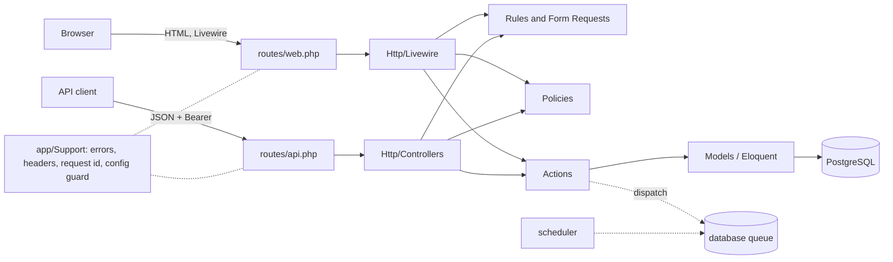

# Architecture

## Today: a layered app with feature folders

- **Features** (`app/Features/<Name>/`) own their models, actions, policies, enums and HTTP
  adapters. `Accounts` (identity) is below `Items` (nothing in Accounts imports Items).
- **Actions** are the business operations (`CreateItem`). They take plain values (`ItemInput`)
  and a model, never a request. Both front doors, the Livewire page and the JSON API, call them,
  so a rule is written once.
- **Support** is the shared kernel: RFC 9457 errors, security headers, request id and trace id
  logging, the startup config guard. It never imports from `Features` (a test enforces it).
- **One composition root per concern:** `AppServiceProvider` (shared), `AccountsServiceProvider`
  (Fortify wiring). Controllers receive actions by constructor/method injection.
- **Patterns used only where they pay off:** DTO (`ItemInput`) at the action boundary, policy per
  model, resource per API shape, form requests for validation. **Not** used: repositories (Eloquent
  is the repository; a wrapper adds code and no isolation), CQRS, event sourcing, a domain
  event bus, an application layer between controller and action.
- **Architecture tests** (`tests/Feature/ArchitectureTest.php`) fail the build when a layer
  imports what it must not.

## Growth stages

### Small (this starter): one deployable, one database

Everything above. Add features by copying `Items` (`docs/EXTENDING.md`). Sessions, cache and
queue use the database, so the stack is app + PostgreSQL + (worker, scheduler) with no Redis.
Scale up by running more `app` replicas behind a proxy: the app is stateless (sessions are in
the database), the filesystem is read-only.

### Medium: modular monolith

Trigger: three or more features, a second team, or features that must not know each other.

- Give each feature `<Feature>ServiceProvider` (routes, policies, bindings, Livewire registration)
  and its own `routes.php`; list the providers in `bootstrap/providers.php`.
- Add `app/Features/<Name>/Contracts/` for the few interfaces other features may call; extend
  `ArchitectureTest` to forbid every other cross-feature import.
- Cross-feature side effects become events (`ItemCompleted`) with listeners that `afterCommit`;
  external publication goes through an **outbox** table written in the same transaction.
- Move queues to Redis-compatible **Valkey** (BSD-licensed; not Redis 8, which is AGPL) with
  Laravel **Horizon**; run `queue` and `scheduler` as separate deployments.
- Add `Idempotency-Key` on API POSTs that cause side effects; add OpenTelemetry (SDK + the
  Laravel auto-instrumentation; `RequestContext` already carries `traceparent` into the logs).
- Octane/FrankenPHP worker mode for throughput (the image already runs FrankenPHP).

### Large: platform

Trigger: separate release cadences, multi-region, or an identity provider mandate.

- Split bounded contexts into Composer path packages (`packages/<context>`) with their own tests;
  boundaries enforced by Pest `arch()` rules or deptrac.
- Replace local passwords with OIDC (Keycloak, Entra, WorkOS) via Socialite; keep Sanctum for
  machine tokens or move them to an API gateway.
- Read replicas (`DB::connection('read')`), queue segmentation with `Queue::route`, a CDN for
  `public/build`, Kubernetes with the liveness (`/healthz`) and readiness (`/readyz`) probes
  this image already exposes, SLSA provenance and image signing in CI.
- Add CQRS or event sourcing only for a bounded context whose read and write shapes truly
  diverge (reporting, audit): the log is that context's product, not a base-app default.
