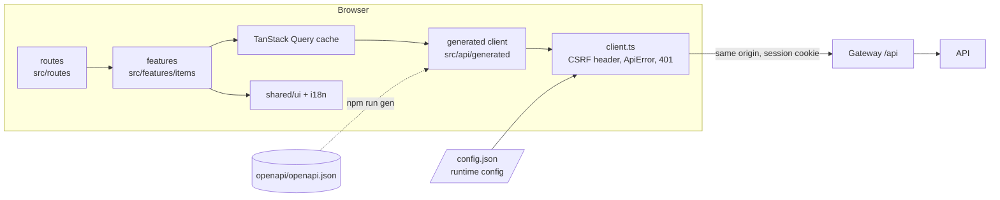

# Architecture

## Shape

Dependencies point one way: `routes` -> `features` -> (`shared`, `api`, `auth`). `shared` imports
nothing from a feature; `api/generated` imports nothing of ours. A feature does not import another
feature: if two need the same thing it moves to `shared`.

## The contract is the centre

`openapi/openapi.json` states what the API promises this app. `npm run gen` turns it into types,
SDK functions, TanStack Query option factories, and zod schemas. The form's limits (name 1 to 120,
quantity 0 to 1,000,000) come from those schemas, so a limit changes in one place. CI regenerates and
fails on any difference (`npm run gen:check`), so a contract change cannot land without its client.

The same contract is checked from the other side: `e2e/contract.spec.ts` calls whichever backend is
running and parses its responses with the generated zod schemas. The full-stack bundles run that
against each of their four backends.

## State

| Kind | Where | Why |
|---|---|---|
| Server data (items, session) | TanStack Query | caching, dedupe, retry policy, optimistic updates in one place |
| Which dialog is open, which item | the URL (`?dialog=edit&id=...`) | linkable, Back closes it, survives reload |
| Form fields | component state | short-lived, local |
| Theme | `localStorage` + `data-theme` | per-device preference; an inline-free `theme-init.js` applies it before paint |
| Configuration | `/config.json` at start | one build, many environments |

No global store: nothing here is client-only state shared across the app. When something is (a
multi-step wizard, an offline queue), add a small store (zustand) beside the feature that owns it.

## Optimistic updates

Create, update and delete change the list before the server answers: cancel in-flight list fetches,
snapshot the cache, patch it, and on error restore the snapshot. `onSettled` always invalidates, so
the screen converges on the server's truth. A row that exists only optimistically (`pending-N`) is
marked busy and cannot be edited or deleted.

## Security model

- **No tokens in the browser** (BFF, RFC 10017): the gateway keeps the session. See `docs/BFF.md`.
- **CSRF**: `SameSite=Lax` cookie plus a custom header the gateway requires on unsafe methods.
- **Strict CSP** (`default-src 'self'`, no inline script or style, no `eval`): the build emits only external
  assets; the e2e suite fails on any violation. nginx and the test servers serve one header table.
- **Same-origin config**: `/config.json` URLs must be paths on this origin; the entrypoint and the client
  both refuse anything else, so the cookie cannot be sent elsewhere.
- **Open redirects**: a return address is carried through sign-in only if it is a path on this origin.
- **Nothing dangerous in the DOM**: no `dangerouslySetInnerHTML` (a lint error), React escapes everything else.
- **Supply chain**: exact versions and a lockfile, `npm audit` gate with an expiring allow-list, Dependabot,
  an SBOM, image pinned by digest, GitHub Actions pinned by SHA.

## Growing it

| Stage | What to add |
|---|---|
| **Small** (this starter) | One feature folder per resource; the contract file; Playwright against the mock. |
| **Medium** | Split `openapi.json` per area; a `shared/forms` layer if forms multiply (react-hook-form fits on top of the zod schemas); error tracking at the `console.error` hooks; Storybook once a design system exists; feature flags via `/config.json`. |
| **Large** | Several apps in a workspace (npm workspaces or pnpm) sharing `shared/ui` and the generated client as packages; contract tests against a published OpenAPI per backend; per-route code splitting budgets in CI; visual regression; real i18n tooling (Lingui or i18next) with translators' workflow. |
| **Enterprise** | Micro-frontends only where team boundaries force them (module federation), a design-system package with its own release train, CSP reporting endpoint, staged rollouts behind flags, SBOM and provenance attestation on every image. |

Each step is additive: the layering above is what makes it a move, not a rewrite.
