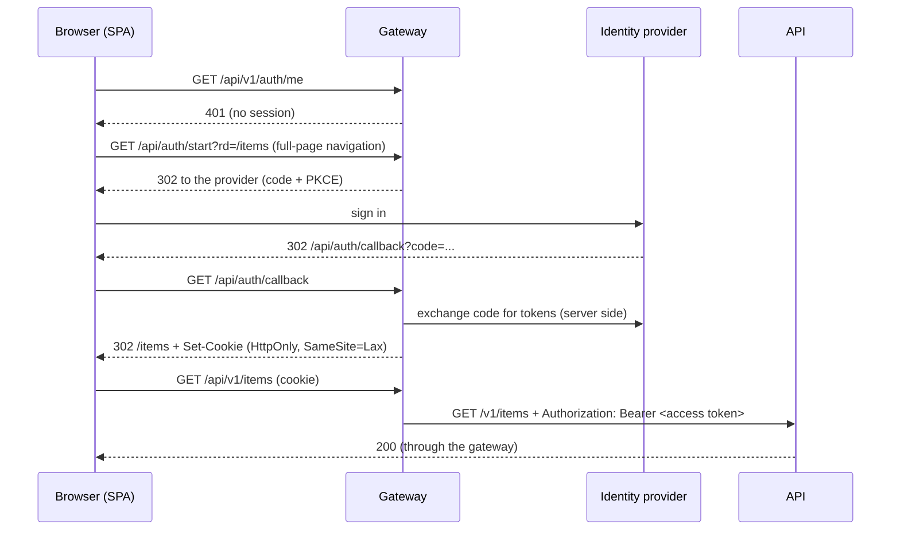

# The gateway contract (BFF)

The app is a public client that never holds a token. Everything it needs from the server side
is below, so you can put it in front of any backend. The full-stack bundles implement it with
Traefik + oauth2-proxy + Keycloak; `mock/api.ts` implements it in 300 lines for development
and tests; anything that does the same will do.

## Why a gateway

RFC 10017 (OAuth 2.0 for Browser-Based Applications) says a backend-for-frontend is the
recommended architecture for business and sensitive applications. A token in `localStorage`
is readable by any script that runs on the page (one XSS bug, one compromised dependency);
an `HttpOnly` cookie is not. The gateway runs the OIDC code flow with PKCE, keeps the tokens
server-side, and hands the browser only a session cookie.

## What the browser does

## The contract

| Request | Meaning |
|---|---|
| `GET /api/auth/start?rd=<path>` | Begin sign-in; after it, redirect to `rd`. `rd` must be a path on this origin (the gateway must reject anything else). |
| `GET /api/auth/sign_out?rd=<path>` | End the session (and the provider's, if you want single sign-out); redirect to `rd`. |
| `GET /api/v1/auth/me` | `200 {"id","email"}` for a valid session, `401` otherwise. Used to decide who is signed in. |
| `* /api/v1/...` | The API of `openapi/openapi.json`. The gateway adds the credentials the API expects. |

Rules the gateway must enforce:

- **CSRF.** The session cookie is `SameSite=Lax` (cross-site `POST`, `PUT`, `DELETE` do not carry it)
  and every unsafe request (`POST`, `PUT`, `PATCH`, `DELETE`) must send `X-Requested-With: fetch`
  or be answered `403`. A cross-origin page cannot add that header without a CORS preflight the
  gateway never grants. The generated client adds it to every call.
- **Cookie.** `HttpOnly`, `Secure` over HTTPS, `SameSite=Lax` (or `Strict`), a name that is not
  guessable as a token. The session lives server-side; the cookie holds only an opaque handle.
- **401, not 302, for API calls.** An expired session must answer `401` to a `fetch`. (The client
  also treats an opaque redirect as an expired session, but a 401 is cleaner.)
- **Same origin.** The SPA, `/api` and `/api/auth/*` share one origin (a reverse proxy routes by
  path), so there is no CORS and the cookie never goes cross-site.

## Changing the URLs

All three are runtime configuration (`/config.json`; `API_BASE_URL`, `LOGIN_URL`, `LOGOUT_URL`
in the container). If your gateway serves sign-in at `/auth/login`, set `LOGIN_URL=/auth/login`;
the app appends `rd=<return path>`.

## Responses the client understands

Errors should be RFC 9457 `application/problem+json`. The client reads `title`, `detail`,
`request_id` and `errors` (an array of `{field|loc, message}` or an object of `field: [messages]`)
and maps field errors onto form fields. Anything else (plain text from a proxy, no body) still
produces a readable error.
